요즘 개발자들 입에 자주 오르내리고, 채용 공고들을 보면 우대사항에서 심심치 않게 볼 수 있는 기술이 있어요. 바로 GraphQL입니다.

GraphQL은 대체 뭘 하는 친구일까요??

## GraphQL이란

GraphQL이란 페이스북에서 개발한 **쿼리 언어**에요. 그렇다면 쿼리 언어란 무엇일까요??

Query의 사전적 의미는 **'질의'** 라는 의미에요.
따라서 Query Language는 질의를 하기 위한 언어, 즉 데이터 요청을 하기 위해 특화된 언어라는 뜻입니다.

Query Language의 대표적인 예시로 **SQL(Structed Query Language)** 이 있어요. 
SQL은 데이터베이스에 저장된 데이터를 가져오기 위해 데이터베이스에 질의하는 언어죠.

GraphQL은 SQL과 같은 쿼리 언어이지만, 언어적 구조 자체가 매우 달라요. 
그 이유는 각자 질의의 목적 자체가 다르기 때문이에요.

SQL은 데이터베이스에 저장된 데이터들을 효율적으로 가져오는 데 목적을 둔 언어에요. 
이와 반대로 GraphQL은 웹 클라이언트 측에서 서버로부터 데이터를 효율적으로 가져오는 데 목적을 둔 언어에요.

보통 질의 언어를 질의하는 쪽에서 작성하는데, 그래서 SQL은 주로 백엔드 시스템에서 작성하게 되고 GraphQL는 주로 클라이언트 시스템에서 작성하게 돼요.

---

## GraphQL 등장 배경

앞서 말했듯이 GraphQL은 FaceBook에서 개발한 쿼리 언어에요. REST API 방식이 현재까지도 많이 쓰이고 있는데, FaceBook은 GraphQL을 왜 만들었을까요??

2012년 당시 FaceBook은 Restful한 서버와 FQL(FaceBook의 SQL) 데이터 테이블을 사용하고 있었어요. 
하지만 앱 충돌이 많이 발생했고, 성능도 좋지 못했어요.

FaceBook은 데이터를 클라이언트로 전송하는 방식을 개선해야 한다는 것을 깨달았고, GraphQL을 개발하기 시작했어요.

기존 REST 방식은 2가지 큰 단점이 존재했어요.

• **Over-Fetching**: 클라이언트에서 사용하려고 데이터를 요청했는데, 데이터를 너무 많이 받아온 경우에요. 쓸모없는 데이터를 보내 통신을 무겁게 하고 프론트측 데이터에 혼동을 줄 가능성이 있어요.

• **Under-Fetching**: 데이터를 요청하고 나서 원하는 데이터를 완전히 받아오지 못해 추가적인 데이터를 또 요청해야 하는 경우를 의미해요. 하나의 EndPoint로 데이터가 충족되지 않아 API를 두번 호출해야 하는 상황이 되고, 이렇게 되면 사용자에게 느린 서비스를 제공할 수 밖에 없게 돼요.

GraphQL은 이 2가지 문제를 해결하고자 했어요. GraphQL을 사용하면 정확히 내가 원하는 데이터만 받을 수 있어 Over-Fetching 문제를 해결할 수 있고, 단 하나의 request만으로 필요한 모든 데이터를 받을 수 있어 Under-Fetching 문제를 해결할 수 있어요.

---

## GraphQL 원리

서버에서는 클라이언트가 GraphQL 방식으로 요청할 수 있는 데이터의 타입들과 각 타입에 대해 요청할 수 있는 필드들을 정의하여 타입 시스템을 구축하고, 각 타입의 각 필드에 대한 요청을 해석 및 처리하는 로직을 Resolver 함수들로 구현해요.

이후 클라이언트가 GraphQL 쿼리를 보내면, 서버는 미리 정의해둔 타입 시스템에 따라 해당 쿼리를 검증(Validation)하고, 문제가 없다면 미리 구현해둔 Resolver 함수들을 호출하여 해당 쿼리를 실행(Execution)한 결과를 클라이언트에게 응답해요.

이러한 방식을 사용하면 여러번 네트워크 호출을 할 필요 없이, 한 번의 네트워크 호출로 요청을 처리할 수 있게 돼요.

### 🍀 Resolver 함수

GraphQL에서는 데이터를 가져오는 구체적인 과정을 직접 구현해야 해요.

GraphQL 쿼리문 파싱은 대부분의 GraphQL 라이브러리에서 처리를 하지만, GraphQL에서 데이터를 가져오는 구체적인 과정은 Resolver 함수가 담당하고, 이를 직접 구현해야 해요.

개발자는 Resolver 함수를 직접 구현해야하는 부담은 있지만, 이를 통해서 데이터 source의 종류에 상관없이 구현이 가능하게 돼요.

---

## 쿼리 & 뮤테이션

### 🍀 필드

GraphQL은 객체에 대한 특정 필드를 요청하는 것이 무척 간단해요

다음은 hero의 이름에 대해 질의하는 쿼리입니다.

보다시피 쿼리의 요청 형식과 쿼리 결과 형식이 동일한 형태인 것을 확인할 수 있어요. 이렇게 항상 기대한 결과를 얻을 수 있다는 점이 GraphQL의 장점이에요.

또 GraphQL 쿼리는 연관된 객체와 필드를 탐색 할 수 있으므로 클라이언트는 여러번 요청을 수행하는 대신 한번의 요청으로 많은 데이터를 가져올 수 있다는 장점도 있어요.

### 🍀 인자

GraphQL은 다음과 같이 필드에 인자를 전달할 수 있는 기능을 제공해요.

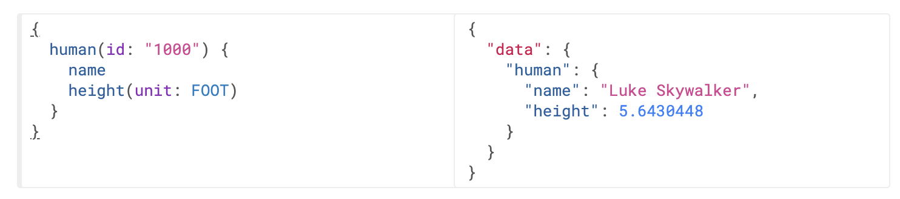

REST 시스템에서는 요청에 쿼리 파라미터와 URL 세그먼트같은 단일 인자들만 전달할 수 있었어요. 하지만 GraphQL에서는 위 예제에서 보다시피 모든 필드와 중첩된 객체가 인자를 가질 수 있으므로 기존에 요청을 여러번 보내야 했던 문제를 완벽히 대체할 수 있어요.

인자로는 다양한 타입을 전달할 수 있어요. GraphQL은 기본적으로 기본 타입을 제공하지만, GraphQL 서버는 데이터를 직렬화 할 수 있는 한 직접 커스텀 타입을 선언할 수도 있습니다.

### 🍀 별칭

결과 객체 필드가 ​​쿼리의 필드 이름과 일치하지만 인자는 그렇지 않으므로 다른 인자를 사용하여 같은 필드를 직접 쿼리할 수는 없어요. 그래서 필드의 결과를 원하는 이름으로 바꿀 수 있는 기능을 제공하는데, 이를 별칭이라고 해요.

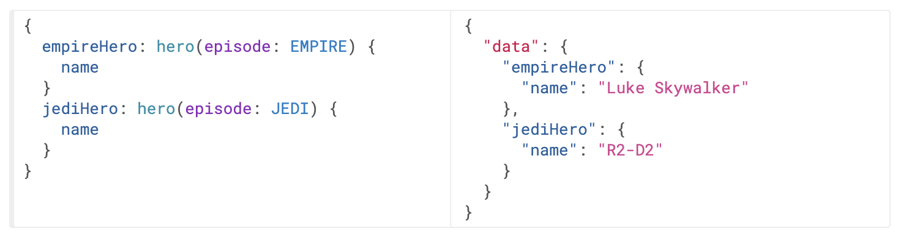

위 예제에서 두 hero 필드에서 다른 인자를 사용하여 충돌이 일어나지만, 서로 다른 이름의 별칭을 지정해서 하나의 요청에서 두 가지 결과를 모두 얻을 수 있어요.

### 🍀 작업 타입

위 예시들에서는 query 키워드와 query 이름을 모두 생략한 단축 문법을 사용했어요. 하지만 실제 애플리케이션에서는 코드를 헷갈리지 않게 하기 위해 키워드와 이름을 생략하지 않는 것이 좋아요. 
공식문서에서도 query 키워드와 query 이름을 생략하지 않는 것을 권장해요.

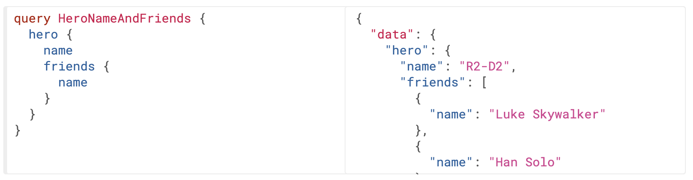

위 예제에서 'query' 부분을 **작업 타입** 이라고 하고, 'HeroNameAndFriends' 부분을 **작업 이름** 이라고 합니다.

작업 타입에는 <code>query</code>, <code>mutation</code>, <code>subscription</code>이 있어요.

작업 이름은 명시적으로 적어주어야 서버의 로깅 및 디버깅에 용이해요.

⭐️ **query**

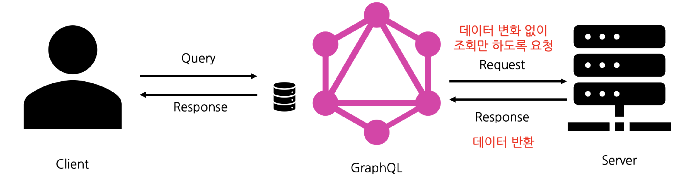

query는 **읽기 전용** 으로 데이터를 가져오기 위한 작업타입이에요. 데이터의 변화 없이 단순 조회가 필요할 때 사용해요.

⭐️ **mutation**

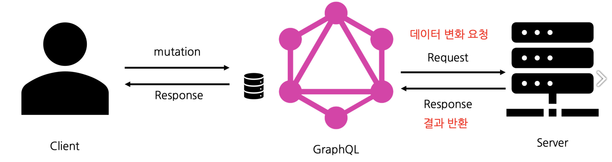

mutation은 **데이터를 변경** 후 가져오기 위한 작업타입이에요. 요청을 통해 데이터를 변화시켜야 할 경우 사용해요.

⭐️ **subscription**

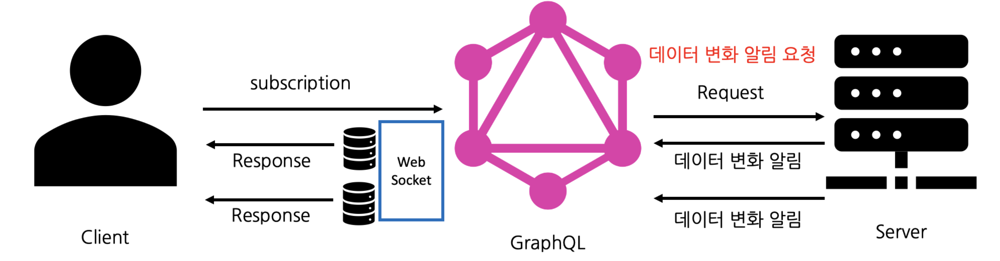

subscription는 **실시간으로 변경된 데이터** 를 가져오기 위한 작업타입이에요. 웹 소켓을 열어두고 데이터 업데이트 시 알려주는 방식으로 구현되어 있어요.

### 🍀 변수

위 예제들에서는 모든 인자를 쿼리 문자열 안에 작성했어요. 하지만 대부분의 응용프로그램에서 필드에 대한 인자는 동적인 경우가 많아요.

클라이언트는 쿼리 문자열을 런타임에 동적으로 조작하고 GraphQL의 특정한 포맷으로 직렬화해야하기 때문에 동적 인자를 쿼리 문자열에 직접 전달하는 것은 좋은 방법이 아니에요.

GraphQL은 동적 값을 쿼리에서 없애고, 이를 별도로 전달하는 방법을 제공한다. 이러한 값을 **변수** 라고 해요.

⭐️ **변수 사용법**

1\. 쿼리안의 정적 값을 <code>$variableName</code> 으로 변경 
2\. <code>$variableName</code>을 쿼리에서 받는 변수로 선언 
3\. 별도의 전송규약 변수에 <code>variableName: value</code> 전달 

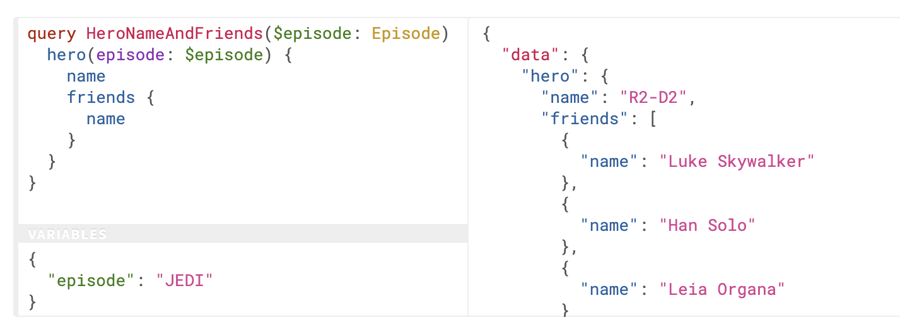

---

## 스키마 & 타입

### 🍀 객체타입 & 필드

GraphQL 스키마의 가장 기본적인 구성 요소는 객체 타입이에요. 객체 타입은 서비스에서 가져올 수 있는 객체의 종류와 그 객체의 필드를 나타내요.

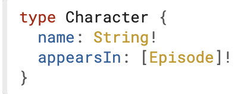

✽ <code>Character</code> 부분은 GraphQL의 객체 타입을 의미해요. 객체 타입은 필드를 가지고 있는 타입을 의미해요. 스키마 대부분의 타입은 객체 타입이에요.

✽ <code>name</code>과 <code>appearsIn</code> 부분은 <code>Character</code> 타입의 필드예요. 즉, <code>name</code>과 <code>appearsIn</code>은 GraphQL 쿼리의 <code>Character</code> 타입 어디에서나 사용할 수 있는 필드입니다.

✽ <code>String</code>은 내장된 스칼라 타입 중 하나예요. 스칼라 타입이란, 하위 필드가 존재하지 않는 타입으로, 구체적인 데이터를 나타내는 타입이에요. GraphQL의 객체 타입은 이름과 필드를 가지지만, 특정 시점에서 모든 필드들은 구체적인 데이터로 해석되어야 해요. 즉, 쿼리의 끝을 나타내는 부분이 필요하고, 이것이 스칼라 타입의 역할입니다.

✽ <code>String!</code>과 같이 필드 뒤에 !가 붙으면 해당 필드가 non-nullable임을 의미해요. non-nullable로 필드를 지정하면, 이 필드를 쿼리할 때 GraphQL 서비스가 항상 값을 반환하는 것을 보장해요.

✽ <code>[Episode]!</code> 처럼 로 감싸져 있으면 객체의 배열을 의미해요. 또 뒤에 !가 붙었기 때문에 non-nullable한 필드예요. 따라서 <code>appearIn</code> 필드를 쿼리할 때 항상 0개 이상의 아이템을 가진 배열을 보장하게 돼요.

### 🍀 인자

GraphQL 객체 타입의 모든 필드는 0개 이상의 인수를 가질 수 있어요.

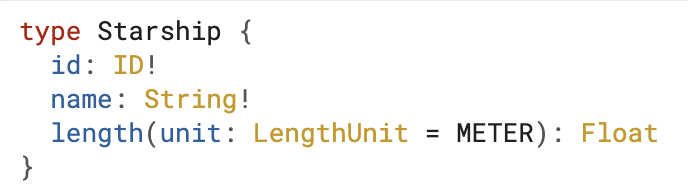

위 예제에서 <code>length</code> 필드가 그 예시입니다. 모든 인수에는 이름이 존재해요. 다른 언어의 함수처럼 인자 전달 순서대로 인자를 인식하는 것이 아니라 GraphQL의 모든 인자는 특별한 이름으로 전달되고 인식해요. 위 예제에서 <code>length</code> 필드는 하나의 인자 unit을 가지게 돼요.

인자는 필수거나 옵셔널일 수 있어요. 인자가 옵셔널인 경우 기본값을 정의할 수 있어요. 
위 예제에서 unit 인자가 전달되지 않으면 기본적으로 METER로 설정돼요.

---

## 인트로스펙션

기존 서버-클라이언트 협업 방식에서는 API 명세서를 주고받는 절차가 반드시 필요했어요. 하지만 명세서 자체가 관리 대상이 되고, 프로젝트 관리 측면에서 관리해야 할 대상의 증가는 작업의 복잡성 및 효율성을 저해시킬 수 있죠. API 명세서는 때때로 관리가 제대로 되지 않거나, 공유가 되지 않아 문제가 발생하는 경우도 적지 않았어요.

이러한 REST API 명세서 공유와 같은 문제를 해결하는 것이 GraphQL의 인트로스펙션 기능이에요. GraphQL의 인트로스펙션은 서버 자체에서 현재 서버에 정의된 스키마의 실시간 정보를 공유를 할 수 있게 하는 기능이에요. 이 스키마 정보만 알고 있으면 클라이언트 사이드에서는 따로 명세서를 요청 할 필요가 없게 되고, 스키마에 맞춰 쿼리문을 작성하면 됩니다.

이러한 인트로스펙션에 사용하는 쿼리가 별도로 존재해요. 일반적인 GraphQL 쿼리문을 작성하듯이 작성하면 돼요.
다만 실제로는 굳이 스키마 인트로스펙션을 위해 따로 쿼리문을 작성할 필요가 없어요. 대부분의 서버용 GraphQL 라이브러리에서 쿼리용 IDE를 제공하기 때문이에요.

다음은 apollo server라는 서버용 GraphQL 라이브러리에 포함 되어있는 웹 IDE 화면입니다.

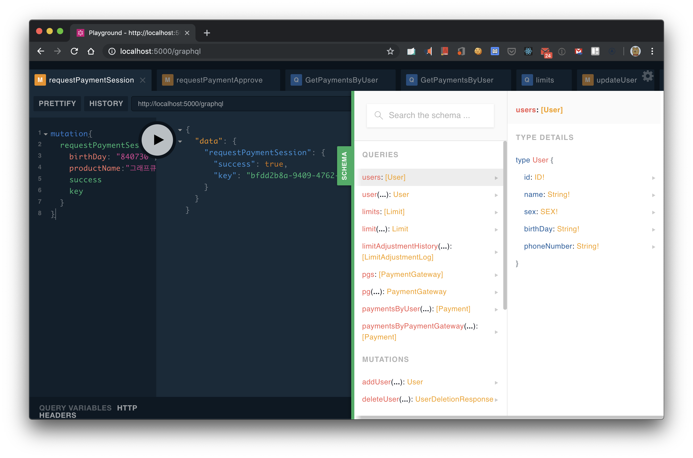

개발자는 인트로스펙션을 활용하여, 직접 쿼리 및 뮤테이션, 필드 스키마를 확인할 수 있어요. 
상용환경에서는 보안상의 이슈로 이러한 스키마의 공개는 신중해야 해요. 대부분의 라이브러리는 해당 기능을 끄고 켜는 옵션이 존재해요.

---

## GraphQL을 사용하는 기업

GraphQL 홈페이지 하단을 보면 GraphQL을 사용하는 기업 목록을 볼 수 있어요. 
유명한 기업들은 다음과 같다.

• **FaceBook**

• **Github**

• **Pinterest**

• **Twitter**

이 중, Github는 API v3에서 REST 방식을 사용하다가 v4에서는 GraphQL로 갈아탔는데, 아래 링크의 글을 읽어보면 GraphQL의 장점을 확인할 수 있어요.

https://docs.github.com/ko/graphql

또, Github Explorer에서 GraphQL을 사용해볼 수 있도록 지원해주는데, 로그인 이후 본인의 계정 정보를 조회해볼 수 있어요.

https://docs.github.com/ko/graphql/overview/explorer

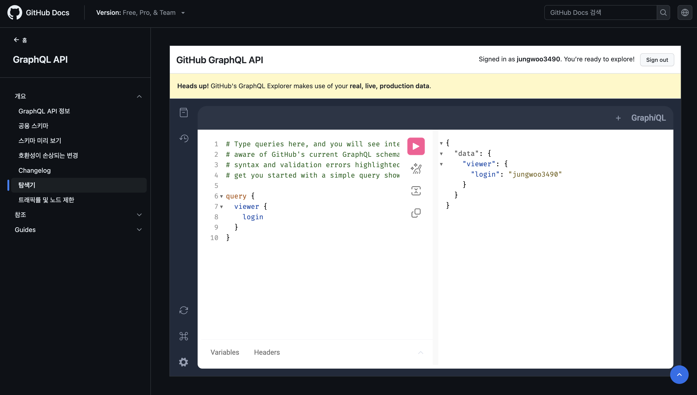

다음과 같이 GraphQL 쿼리를 활용해서 로그인된 유저 닉네임을 조회하였고, 로그인한 저의 닉네임이 잘 표시되는 것을 확인할 수 있었어요.
