Lecue는 온라인으로 축하를 주고받는 목적으로 개발한 롤링페이퍼 서비스입니다. 축하를 받고 싶은 사람이 롤링페이퍼를 만들고 링크를 공유하면, 축하해주고 싶은 사람들이 링크를 타고 롤링페이퍼 페이지에 진입해서 축하 메시지를 작성하는 서비스입니다.

여기서 유저가 롤링페이퍼 페이지에 진입했을 때, 딱히 무거운 요소가 없는데도 첫 Paint가 느린 문제를 식별했고, 유저 입장으로 바라보았을 때 경험이 좋지 못하다고 생각해서 개선해보고자 했습니다.

초기 로딩 시간은 유저 경험에 있어 아주 중요한 지표입니다. 구글 리서치 자료에 따르면 로딩 시간이 3초 이상이면 이탈률이 32% 라고 합니다.

Lighthouse로 측정한 롤링페이퍼 뷰 지표는 다음과 같았습니다.
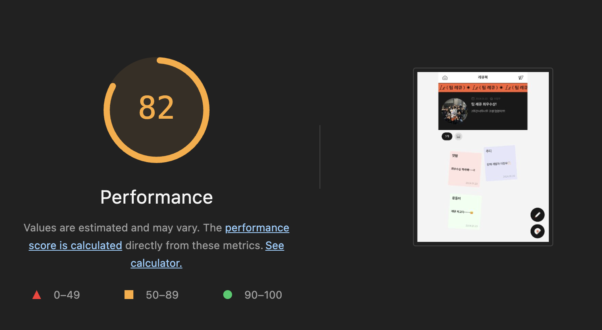
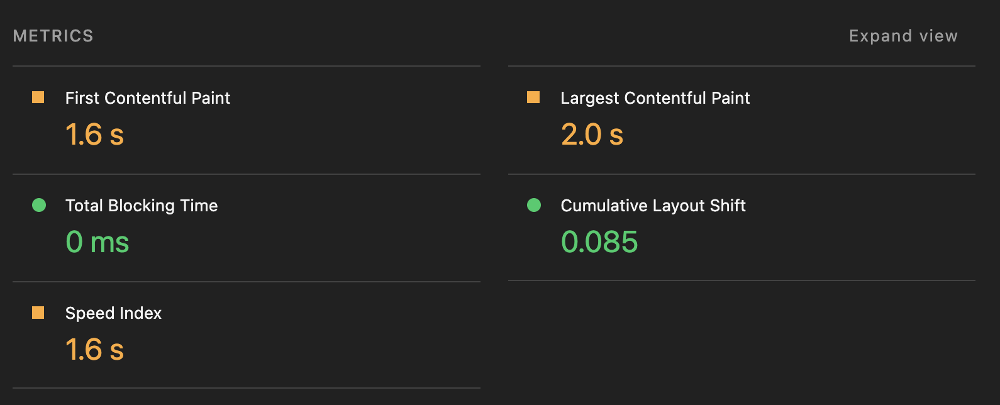

FCP와 LCP 지표가 좋지 않게 나온 것을 확인할 수 있습니다. FCP와 LCP 차이가 크지 않다는 부분에서 FCP 타임 자체가 느렸기 때문에 LCP도 낮게 측정되었다고 생각했고, FCP를 개선하면 LCP 지표도 자연스레 개선될 것이라고 생각했습니다.

FCP가 낮은 이유가 SPA의 동작방식과 연관이 있을 것이라고 생각했습니다. SPA는 초기에 흰 화면을 보여준 뒤, 모든 JS 번들을 다 로드한 뒤에 Paint를 진행합니다. 유저 입장에서는 첫 Paint 이후에 페이지를 이동할 때 이미 그 페이지에 필요한 번들이 로드된 이후이므로 굉장히 부드럽게 페이지를 이동할 수 있습니다. 하지만 모든 JS 번들을 다 로드해야 하므로 그만큼 초기에 기다리는 시간이 오래 걸린다는 단점이 있습니다.

이러한 SPA의 단점을 해결하기 위해서 가장 먼저 생각나는 방법은 고성능의 서버에서 렌더링을 미리 해서 주는 SSR입니다.
SSR은 FCP를 단축시키는 좋은 방법일 수 있습니다. 유저 입장에서 처음부터 흰 화면이 아니라 일부가 Paint된 화면을 바로 볼 수 있기 때문입니다.
하지만 SSR 방식을 사용한다고 해도 하이드레이션이 필요한 번들의 크기가 크다면 FCP가 개선되더라도 TBT/TTI 지표가 악화되어 UX에 악영향을 미칠 수 있습니다.

그래서 번들 자체의 크기를 줄이는 방법이 근본적인 해결책이라고 생각했고, 먼저 프로젝트에 어떤 번들이 있는지, 큰 사이즈를 차지하는 번들이 있는지 분석해보았습니다. 결과는 다음과 같았습니다.

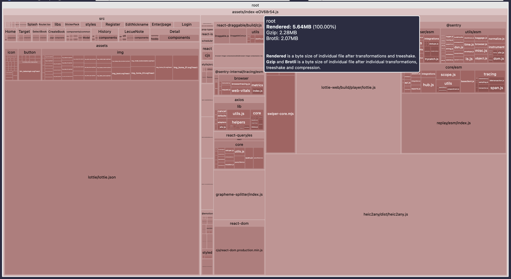

한 눈에 봐도 커다란 덩어리가 3개 보입니다. Lottie.json이라는 Lottie 에셋과, lottie.js, heic2any.js라는 라이브러리가 도합 약 3.5Mb의 용량을 차지하고 있었습니다. 3개의 리소스가 전체 번들의 63%를 차지하고 있습니다.

이 친구들이 불필요한 요소들인가? 에 대해 생각해보았을 때 프로젝트에 반드시 필요한 요소들이었습니다. 또 이 친구들을 용량이 더 작은 리소스로 대체가 가능한 친구들인가? 에 대해 생각해보았을 때 그렇지 않다는 결론을 내렸습니다.

그렇다면 이 3개의 리소스를 어떤 전략을 사용해서 최적화시킬 수 있을지 하나씩 고민하고 개선해보았습니다.

## Lottie.json

Lottie.json은 Lottie 애니메이션을 구성하는 정적 JSON 데이터입니다. 번들에서 30%를 차지하는 큰 요소입니다.

Lottie는 랜딩페이지에서만 사용되는 리소스입니다. 현재 유저가 롤링페이퍼 뷰에 진입했을 때 Lottie.json 데이터는 사용되지 않으며, 유저 플로우 상 공유된 롤링페이퍼 뷰로 바로 접근했을 때에는 URL을 직접 변경하지 않는 이상 서비스 내부 이동만으로는 랜딩페이지로 접근이 불가능합니다. 이러한 특성을 고려했을 때, Lottie.json을 초기 번들에 포함시키는 것은 불필요한 비용이라고 판단했습니다.

이에 따라 기존에 src 내부에 포함되어 있던 Lottie 에셋을 public 디렉터리로 분리하여 정적 리소스로 관리하는 방식을 선택했습니다. 이를 통해 무거운 JSON 파일을 자바스크립트 번들에서 제거할 수 있었습니다.

하지만 번들에서 분리하게 되면 몇가지 단점도 존재하는데, Lottie.json에 대입해서 단점들을 생각해보았습니다.

먼저 번들에서 분리하게 되면 해당 리소스는 번들러의 의존성 그래프 관리 대상에서 제외됩니다. 하지만 Lottie.json은 단순한 정적 파일로, 다른 리소스에 대한 의존성이 존재하지 않는 독립적인 파일입니다. 선행 로드해야 할 리소스가 없으며 로드 순서 관리나 의존성 추적이 필요없습니다.

또 번들에서 분리하면 Tree-shaking이 되지 않습니다. Lottie.json은 단일 JSON 파일로 구성된 정적 리소스이기 때문에, 코드 단위로 분리하거나 제거할 수 있는 구조가 아니며 Tree Shaking의 대상이 될 수 없습니다. 즉 번들에 포함되더라도 항상 전체 파일이 로드되기 때문에 Tree Shaking을 통해 얻을 수 있는 이점이 없습니다.

또 번들에서 분리하면 리소스가 변경될 때마다 캐시 무효화를 위해 이름을 변경해주는 직접적인 관리가 필요하다는 번거로움이 있는데, Lottie 에셋은 바뀔 가능성이 거의 없는 에셋이기 때문에 캐시 무효화 관리가 불필요하다고 생각했습니다.

따라서 트레이드오프를 생각해보았을 때 현재 상황에서는 번들에서 lottie 에셋을 분리하는 것이 이점이 더 많다고 생각했습니다. 그 결과 총 번들 사이즈가 5.64MB에서 3.9MB로 감소했습니다.

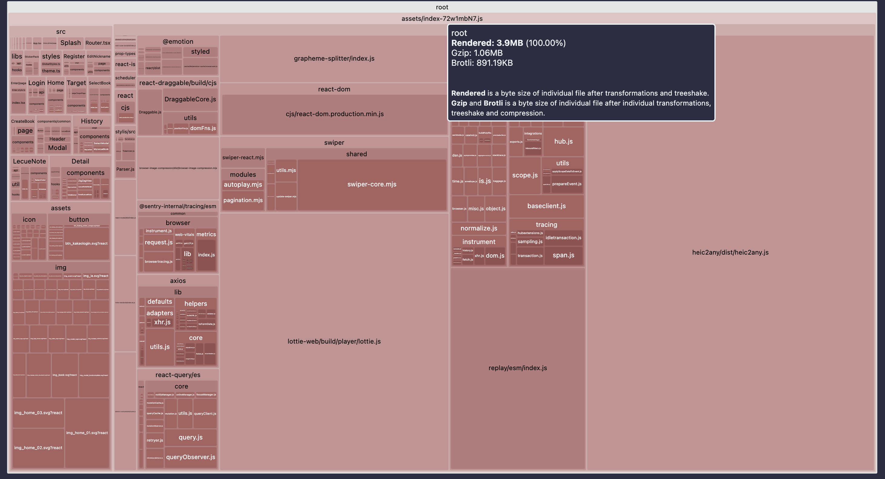

아직 2개의 큰 리소스가 남았습니다. 이 리소스들도 최적화를 해볼 수 있을지 고민해보았습니다.

## lottie.js

`lottie.js`는 Lottie 정적 asset 데이터를 `<Lottie />`라는 컴포넌트를 이용해 React 컴포넌트로 렌더링할 수 있게 도와주는 라이브러리입니다.

`lottie.js`는 npm 라이브러리이기 때문에 번들에서 제거하기는 어렵습니다. 하지만 롤링페이퍼 뷰로 초기 진입한 유저는 서비스 내의 이동만으로 Lottie를 볼 수가 없습니다. 그런데 SPA의 특성으로 인해 롤링페이퍼 뷰로 진입한 유저는 사용되지도 않는 무거운 `lottie.js`를 로드할 때까지 기다려야 하고, 이는 FCP에 악영향을 미치게 됩니다.

번들에서는 제거하기 어렵지만, 코드스플리팅을 통해 초기 번들에서 분리하여 원하는 타이밍에 리소스를 로드할 수 있습니다.

코드스플리팅의 가장 흔한 전략은 페이지별로 코드스플리팅을 하는 전략일 것입니다.
일반적으로 페이지 단위로 사용하는 코드가 나뉘어지기 때문입니다.

하지만 이것이 장점만 있을까요?? 생각해보면 A 페이지에 진입할 때 A페이지에 대한 번들만 받아오면, B 페이지로 이동할 때 B 페이지에 필요한 번들이 없습니다. 결국 추가적인 번들을 받아오는 동안 유저는 기다릴 필요가 있고, SPA의 장점인 부드러운 페이지 전환의 이점이 감소하게 됩니다.

Next.js에서는 `<Link>` 컴포넌트의 prefetch 기능을 제공하여 이러한 latency를 방지합니다. 하지만 결국 스플리팅을 했다면 페이지 이동 전에 추가적인 네트워크 요청이 필요하고, 유저가 이동할 가능성이 낮은 페이지를 prefetching하는 것은 네트워크 낭비가 될 수 있습니다.

그래서 저는 그냥 무조건 페이지별로 분리하는 것이 아니라, 유저 플로우를 고려해서 코드 스플리팅 전략을 세워보기로 했습니다.

저희 서비스의 유저는 크게 롤링페이퍼를 생성하는 유저와 생성된 롤링페이퍼에 축하 메시지를 작성하는 유저로 나뉩니다. 그리고 각각의 유저 플로우가 다릅니다.

롤링페이퍼를 새롭게 작성하는 유저는 랜딩페이지로 진입해서 롤링페이퍼 제작 버튼을 누른 후, 롤링페이퍼 생성에 필요한 여러 정보를 단계별로 기입하고 롤링페이퍼를 생성합니다.

축하메시지를 작성하는 유저는 공유된 롤링페이퍼 링크에 접속하여 롤링페이퍼 뷰에 진입한 다음 메시지 작성 뷰로 이동하여 메시지를 작성합니다.

두 유저 플로우를 보면, 유저별로 서비스의 진입점이 다르다는 것을 알 수 있습니다. 롤링페이퍼를 생성하는 유저의 진입점은 랜딩페이지이고, 메시지를 작성하는 유저의 진입점은 롤링페이퍼 페이지입니다.

롤링페이퍼 서비스의 당연한 특성이겠지만, 롤링페이퍼를 제작하는 사람보다 롤링페이퍼에 메시지를 작성하러 서비스를 이용하는 유저의 수가 훨씬 많았습니다.

그렇다면, 남은 무거운 번들 중 랜딩페이지에 사용되는 `lottie.js`는 굳이 초기에 로드하지 않는 게 이득이라고 판단했습니다. 상세 페이지에 초기 진입을 한 유저는 플로우 상 Lottie를 보지 못하고 서비스 이용을 종료하기 때문입니다.

이를 위해 먼저 Lottie가 포함된 랜딩페이지를 스플리팅하는 방법을 생각해볼 수 있습니다.

페이지 자체를 스플리팅했을때의 장점은 롤링페이퍼 뷰로 초기 진입할 때 `lottie.js` 번들을 받아오지 않기 때문에 FCP가 개선됩니다. 하지만 초기 진입 시 번들이 로드되지 않아 추후 이 페이지로 로드할 때 번들을 받아올때까지 페인팅이 블로킹되는 단점도 존재합니다.

여기서 유저 플로우를 생각해보았을 때, 랜딩페이지는 초기진입으로만 접근이 가능한 페이지입니다. 롤링페이퍼 뷰로 초기진입을 하면 접근할 수 없는 페이지입니다.
그렇다면 페이지를 스플리팅했을 때 발생하는 단점은 랜딩페이지에서 고려하지 않아도 됩니다. 초기 진입이 아닌 페이지 이동으로 랜딩페이지에 이동하는 경우는 없기 때문입니다. 랜딩페이지로 초기 진입시에는 어차피 랜딩 페이지의 번들도 필요하므로, 초기 번들에 포함되든 안되든 결과는 같습니다.

그래서 랜딩페이지를 스플리팅하는 것은 현재 상황에서 적절하다고 판단했습니다.

하지만 생각해볼만한 단점이 하나 존재합니다. 유저가 랜딩페이지로 초기 진입하게 되면 결국 `lottie.js`를 포함한 번들을 받아올때까지 페이지 전체 fallback을 봐야 합니다. 이는 UX를 해치게 됩니다.

이런 단점을 해결하기 위해서, `lottie.js`를 기다리지 않고 먼저 Paint를 하면 해결되지 않을까? 하는 생각을 했습니다. 이를 위해 `lottie.js`를 동적 import로 불러오도록 하여 첫 Paint가 `lottie.js`를 기다리지 않도록 구현했습니다.

라이브러리를 동적 import로 가져온다고 했을 때 유저는 초기 렌더링에 Lottie를 제외한 UI를 먼저 보고, 이후에 라이브러리를 로드하게 되므로, 전체적인 초기 로딩 체감 속도가 개선됩니다. 또 유저는 리소스를 기다릴 수도 있고, 바로 시작하기 버튼을 누를수도 있는 선택권을 갖게 됩니다.

이러면, 그냥 페이지 전체 말고 `lottie.js`만 스플리팅해도 될까? 에 대해 고민해보았습니다. 그렇게 되면 2가지 문제점이 있다고 판단했습니다.
1. 롤링페이퍼 뷰로 진입하는 유저는 서비스 이용 내내 사용되지 않을 랜딩페이지 번들이 메인 번들에 포함됩니다.
2. 후술할 리소스 로딩 Waterfall 문제를 해결할 때 부수적인 문제점이 발생합니다. 이는 밑에서 자세히 설명하겠습니다.

따라서 랜딩페이지를 스플리팅하였고, 그 내부에서 `lottie.js`도 스플리팅하는 전략을 사용했습니다.

지표 개선은 되었지만, 지표 개선이 항상 유저 경험 개선에 비례하진 않다고 생각합니다. 제가 느끼기에 유저 경험을 위해 더 개선해야 할 부분이 있었습니다.

### 리소스 로딩 시간동안 느껴지는 시각적인 부자연스러움

Lottie.js의 특징은 초기 렌더링 결과물에 영향을 미치는 라이브러리라는 것입니다.
랜딩페이지 이미지를 확인해보겠습니다.

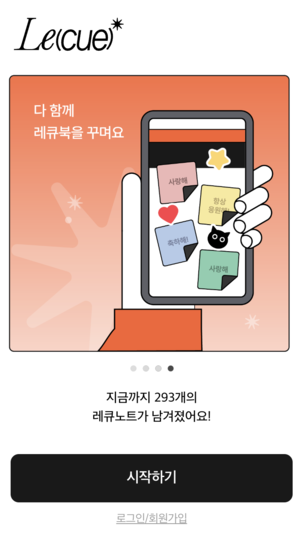

위와 같이 Lottie는 뷰포트에서 차지하는 비중이 큰 크리티컬한 리소스입니다. 만약 라이브러리 번들만 코드스플리팅한다면 페이지는 빠르게 나타나지만, 유저는 일부 시간동안 뷰포트의 대부분이 텅 비어있는 화면을 보게 될 것입니다.

이는 Skeleton UI를 fallback으로 보여주면 해결이 가능할 것이라고 생각했습니다. Lottie 데이터는 이미 크기가 정해진 정적 리소스였기 때문에 size를 Lottie에 맞게 세팅하여 보여주면 fallback과 실제 리소스의 크기 차이에서 오는 Layout Shift 문제를 해결할 수 있습니다.

fallback으로 Skeleton UI와 로딩 스피너의 선택지가 있었는데, 이미 크기를 알고 있는 상태에서는 최대한 리소스의 크기와 모양에 맞게 Skeleton UI를 보여주는 것이 시각적으로 추후에 어떤 모양과 크기의 리소스가 받아질 지 인지시킬 수 있다는 장점이 있다고 생각했습니다. 아래는 각각 로딩 스피너와 Skeleton UI를 적용해본 모습인데, 확실히 Skeleton UI를 적용했을 때가 시각적으로 전환이 더 자연스럽다는 것을 확인할 수 있었습니다.

|       로딩 스피너       |        Skeleton UI        |
| :---------------------: | :-----------------------: |
| 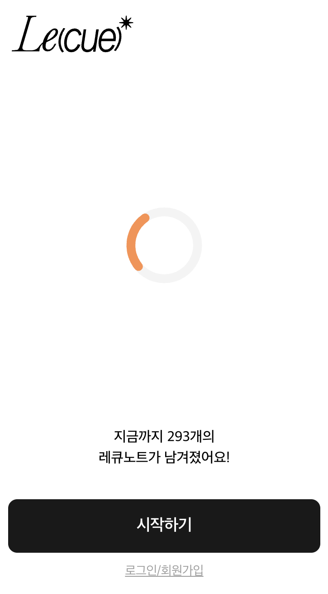 | 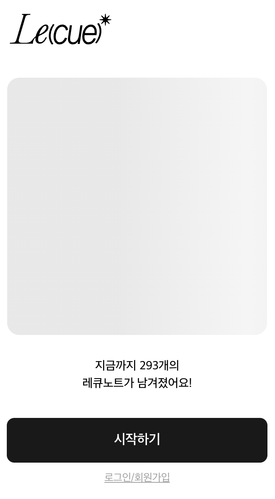 |

로컬 서버에서 테스트해보면 리소스가 빠른 속도로 로드되어 개선 전후의 차이가 시각적으로 크게 느껴지지는 않지만, 중요한 것은 우리가 현재 성능을 테스트하고 있는 환경이 고성능 PC 환경이라는 점입니다. 유저의 테스트 환경 상 개발자의 PC보다는 성능이 떨어지고, 이 서비스는 모바일 브라우저에서 구동되는 웹 페이지이기 때문에 대개 PC보다 성능이 떨어집니다. 또 항상 빠른 네트워크 환경이 보장되지 않기 때문에 이 또한 고려를 해야 합니다.

랜딩페이지로 초기진입을 할 때 개선 이전과 개선 이후를 Slow 4G 환경으로 Network throttle을 걸어 비교해본 결과입니다.

<table>
  <tr>
    <th>개선 전</th>
    <th>개선 후</th>
  </tr>
  <tr>
    <td>
      <video width="100%" controls>
        <source src="/blog/lecue-ux/before-splitting.mp4" type="video/mp4" />
      </video>
    </td>
    <td>
      <video width="100%" controls>
        <source src="/blog/lecue-ux/after-splitting.mp4" type="video/mp4" />
      </video>
    </td>
  </tr>
</table>

확실히 개선 이후 유저가 첫 화면을 보는 속도가 빨라졌습니다. 네트워크가 느린 환경일 수록 개선 전후의 차이가 더욱 커질 것입니다.

이렇게 하여 비교적 빠른 초기진입 속도도 챙기고, 추가 번들 청크를 받아올 대기 시간에 Skeleton UI를 사용해서 시각적으로 자연스러움을 유지할 수 있었습니다. 또 유저는 Lottie 리소스를 기다리거나, 빠른 이용을 위해 기다리지 않고 시작하기 버튼을 눌러도 되는 선택권을 갖게 되었습니다.

### 랜딩페이지 리소스 로딩 Waterfall

현재 구조라면 메인페이지로 진입했을 때 초기 번들 이외에 `lottie.json`과 스플리팅된 `lottie.js`에 대해 추가 네트워크 요청이 발생합니다.

리소스 로딩을 Performance 탭에서 분석해보았습니다.

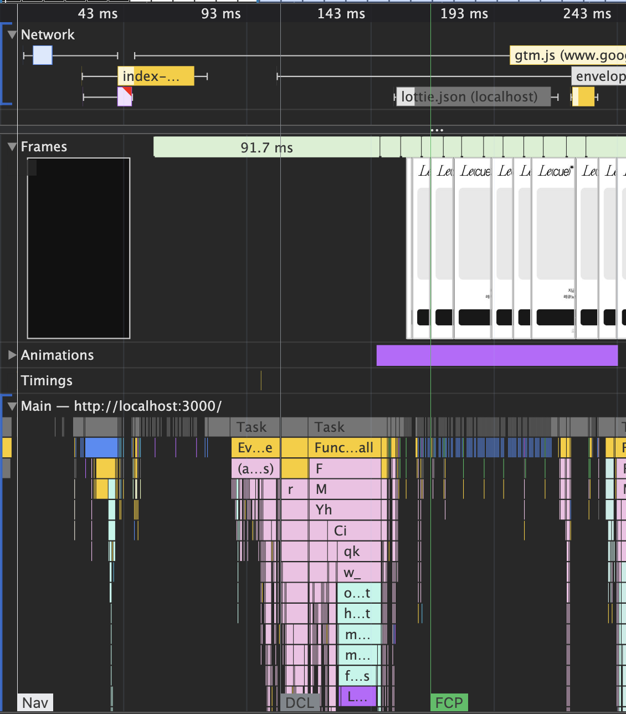

`lottie.json`을 useEffect에서 fetch하기 때문에 첫 Paint와 동시에 `lottie.json`을 로드하는 것을 확인할 수 있습니다.

`lottie.js` 번들은 `lottie.json` 우측에 있는 노란색 번들입니다.
`lottie.json` fetch의 `then` callback으로 `lottie.js`를 가져오는 것이 아니었음에도 `lottie.json`이 받아지고 나서야 `lottie.js` 번들이 로드되는 것을 확인할 수 있었습니다.

Waterfall이 발생하는 원인을 코드 레벨에서 먼저 분석해보았습니다.

```js
const Lottie = lazy(() => import("lottie-react"))

function Body() {
  const [animationData, setAnimationData] = useState(null)

  useEffect(() => {
    fetch("/lottie/lottie.json")
      .then(res => res.json())
      .then(setAnimationData)
  }, [])

  return (
    <Suspense fallback={<Skeleton />}>
      {animationData ? <Lottie animationData={animationData} /> : <Skeleton />}
    </Suspense>
  )
}
```

Suspense fallback으로 지정된 Skeleton은 lazy load하는 `lottie.js`를 위한 fallback이고, 삼항연산자 Skeleton은 animationData를 위한 Skeleton입니다. 둘 다 로드가 되어야만 Lottie를 정상적으로 렌더링할 수 있기 때문입니다.

```js
const Lottie = lazy(() => import("lottie-react"))
```

이 line은 Lottie가 사용이 될 때 `lottie-react`를 lazy load하겠다는 구문입니다. 하지만 현재 코드대로라면 lottie.json의 fetch가 완료되고 then 콜백이 모두 실행되어 `animationData` state가 변경되어야 Lottie가 사용되고, 그때 `lottie-react` 로드를 시작하게 됩니다.

저는 이 Waterfall이 비효율적이라고 생각했습니다. 두 리소스는 독립적이고, `lottie.js`의 로드에 `lottie.json`이 관여하지 않기 때문입니다.

어떻게 개선할 수 있을까요? animationData가 받아와지든 말든, 기다리지 말고 먼저 일단 로드를 하면 될 것 같습니다. 위 lazy import 라인을 다음과 같이 바꿔보겠습니다.

```js
const lottiePromise = import("lottie-react")
const Lottie = lazy(() => lottiePromise)
```

이렇게 되면 모듈 평가 단계에서 import는 lazy 구문 밖에 있기 때문에 Lottie의 렌더링을 기다리지 않고 즉시 로드하게 됩니다.

`lottiePromise`에는 lottie-react 모듈을 로드하는 Promise가 저장됩니다. 그리고 `lazy(() => lottiePromise)`에서 이 Promise를 그대로 사용합니다. 결국 개선 전에서 lottie.js의 네트워크 요청 시점만 앞당겨지는 것이 되고, Waterfall 문제를 해결할 수 있습니다.

개선 후 Performance 탭에서 분석해보겠습니다.<br/>
lottie.js가 `Body.tsx` 모듈 평가단계에서 바로 로드되는 것을 확인할 수 있습니다.

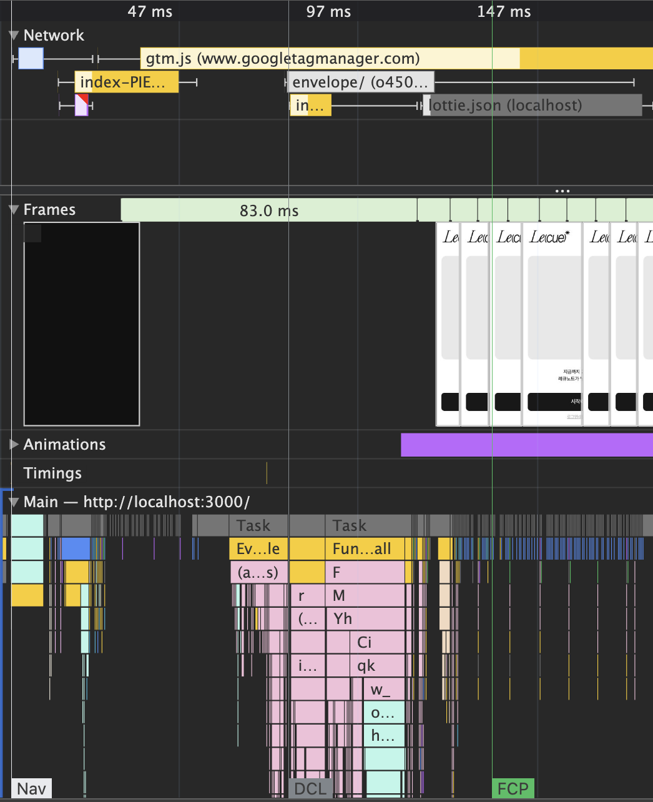

추가적으로, 아까 위에서 `lottie.js`만 스플리팅하고 랜딩페이지를 스플리팅하지 않으면 문제가 발생한다고 적었는데, 어떤 문제인지 설명해보겠습니다.<br/>

Waterfall 해결을 위해 위 코드처럼 변경하면 `lottie.js`는 `Body.tsx`가 평가되는 시점에 로드됩니다. 다르게 말하면, `Body.tsx`가 평가되기만 하면 `lottie.js`가 로드됩니다.

`Body.tsx`는 랜딩페이지에 포함된 컴포넌트입니다. 즉 `Body.tsx`가 스플리팅되지 않으면, 롤링페이퍼 뷰로 초기진입 시에도 평가되고 `lottie.js`가 로드됩니다. `lottie.js`를 스플리팅한 가장 주된 목적이 롤링페이퍼 뷰로 초기 진입 시 로드하지 않게 하기 위해서였는데, 다른 부분을 최적화하다 결국 스플리팅하는 주된 목적이 사라져버렸습니다.

실제로 랜딩페이지 코드스플리팅을 해제하고 롤링페이퍼 뷰 초기 진입 시 TreeMap을 확인한 결과입니다. `lottie.js`가 포함되어 있는 것을 확인할 수 있습니다.

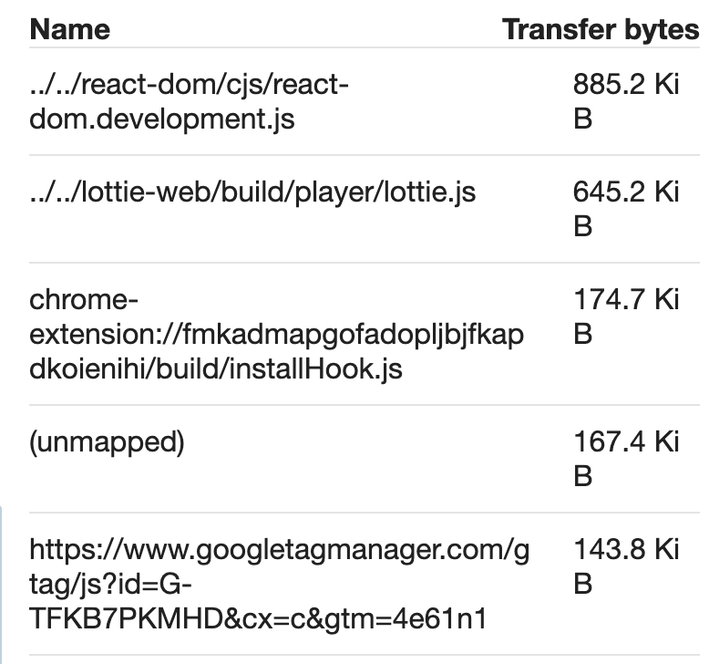

랜딩페이지 코드스플리팅을 추가한 TreeMap입니다. `lottie.js`가 포함되지 않은 것을 확인할 수 있습니다.

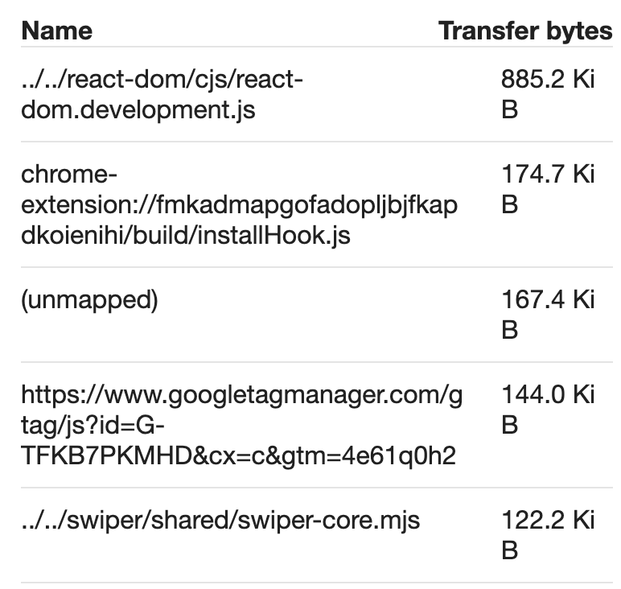

그래서 결국 랜딩페이지와 `lottie.js`를 각각 스플리팅하는 방법을 선택했습니다.<br/>
롤링페이퍼 뷰로 초기 진입하는 유저는 랜딩페이지 스플리팅으로 메인 번들에 불필요한 랜딩페이지 번들이 전혀 포함되지 않고, 랜딩페이지 뷰로 초기 진입하는 유저는 `lottie.js` 스플리팅으로 무거운 Lottie가 불러와지기 전에 어느정도 완성된 화면을 볼 수 있고, 다음 페이지로 이동할 수도 있게 되었습니다.

## heic2any.js

`heic2any.js`는 롤링페이퍼 뷰에서 사용되는 라이브러리가 아니라 메시지를 작성하는 페이지에서 사용되는 라이브러리입니다. Apple은 기본적으로 `heic`라는 이미지 포맷을 사용하는데, heic가 웹 표준 포맷이 아니기 때문에 브라우저에서 표시가 되지 않습니다. 그래서 heic를 다른 이미지 포맷으로 변환시켜주는 것이 `heic2any`입니다. 롤링페이퍼의 배경으로 이미지를 넣을 수 있기 떄문에 롤링페이퍼 작성 시 꼭 필요한 기능입니다.

롤링페이퍼 뷰로 초기 진입을 했다면, 그 다음으로 유저가 이동 가능성이 가장 높은 페이지는 메시지 작성 페이지일 것입니다. 이 점을 감안한 채로, 코드스플리팅을 할 수 있는 여러가지 케이스에 대해 생각해보았습니다.

먼저, 초기 번들에 포함시키는 방법입니다. 직접 메시지를 작성하려고 들어가는 유저도 많겠지만, 롤링페이퍼를 생성한 당사자나, 혹은 그냥 열람만 하려고 들어간 유저들은 메시지 작성 뷰에 진입을 하지 않을 것입니다. 이러한 유저들에게는 초기 번들에 사용되지도 않는 무거운 라이브러리를 포함하는 게 불필요할 것입니다.

다음으로, 페이지 전체를 스플리팅하는 방법입니다. 이렇게 한다면 초기 번들에 메시지 작성 뷰 번들이 포함되지 않아 롤링페이퍼를 열람만 하는 유저는 빠른 초기 접속을 경험할 수 있습니다. 하지만 작성 뷰로 넘어가는 과정에서 무거운 `heic2any` 라이브러리를 받아올 때까지 렌더링이 지연되게 됩니다.

페이지 전체를 스플리팅한 후 Slow 4G 환경으로 Network throttle을 걸어 속도를 측정해본 결과입니다. 확실히 페이지 이동 시 유저 경험이 저하된다는 것을 확인할 수 있습니다.

<div style="display: flex; justify-content: center;">
  <video width="300" controls>
    <source src="/blog/lecue-ux/routing-before.mp4" type="video/mp4" />
  </video>
</div>

그렇다면 라이브러리만 스플리팅하면 되지 않을까요??
라이브러리만 스플리팅한다고 하면, 이 리소스를 받아오는 시점이 중요합니다. 3가지 시점을 생각해보았습니다.

먼저 사용하는 핸들러 함수에서 받아오는 방법입니다.
하지만 네트워크 환경이 느릴 경우 리소스를 받아오기 전까지 변환 로직이 실행되지 못하기 때문에 업로드 자체에 지연이 발생할 수 있습니다.

다음으로 렌더링 시에 받아오는 방법입니다. 함수가 사용될 때 받아오는 것보다는 빠르게 받아올 수 있지만 만약 페이지 렌더링 후 즉시 사용되어야 하는 라이브러리라면 느린 네트워크 환경에서 문제가 발생할 수 있습니다.

마지막으로 프리패칭입니다. 페이지 이동 전에 리소스를 미리 로드하는 방법으로, 3가지 방법 중 가장 빠르게 받아올 수 있는 방법입니다. 렌더링 후 즉시 사용되어야 하는 라이브러리에도 문제가 발생할 가능성이 적습니다. 하지만 만약 유저가 이동하지 않는다면 불필요한 추가 네트워크 요청이 발생하는 셈입니다.

먼저 heic2any의 특징은 페이지의 초기 UI를 구성하는 데 사용되지 않으며, 사용자 액션 이후에만 사용되는 라이브러리입니다.
다음으로 저희 서비스에 대해 생각해보았습니다. 먼저 유저가 이 페이지로 반드시 이동하는가에 대해 생각해보았을 때, 롤링페이퍼 뷰 접속자 대비 메시지를 작성하는 유저의 비율이 더 적었습니다. 즉, 메시지를 작성하는 사람보다 단순 구경하러 접속한 사람이 많았습니다.
마지막으로 heic2any가 사용되는 시점까지의 유저 플로우를 살펴보면, Apple 기기를 사용하는 유저가 iPhone 내장 카메라로 사진을 촬영하고, 작성 페이지에서 해당 이미지를 선택하면, 파일의 확장자를 체크하고 만약 확장자가 heic일 경우 확장자 변환 함수를 호출하는데, 이때 heic2any가 사용됩니다. 유저가 페이지에 진입해서 카메라 아이콘을 누르고, 사진을 촬영/선택하기까지 대개 수 초의 시간이 걸리고, 그때까지 번들이 로드되지 않을 가능성이 매우 낮다고 생각했습니다.

그래서 제가 선택한 최적의 방법은 렌더링 시에 라이브러리를 동적 import하는 방법이었습니다. 함수가 호출되는 시점에 로드하면 느린 네트워크 환경에서 문제가 발생할 수 있는 가능성이 있다고 생각했습니다. 프리패치를 하기에는 렌더링에 영향을 주는 라이브러리도 아니고, 작성 페이지로 이동하지 않는 유저들도 많아서 불필요한 네트워크 낭비나 스레드 점유가 발생할 수 있다고 생각했습니다. 또 렌더링 후 라이브러리가 직접적으로 사용되기까지 충분한 여유 텀이 존재하기 때문에 프리패치 방식으로 이득 볼 만한 부분이 적다고 판단했습니다.

이를 통해 초기 렌더링 성능을 해치지 않으면서, 실제 기능 사용 전에 로딩을 완료할 수 있고, 불필요한 네트워크 요청도 최소화할 수 있었습니다.

다음은 최적화한 후 개선 전 영상과 동일한 환경에서 테스트한 결과입니다.
메시지 작성 뷰로 지연 없이 부드럽게 이동하고, 무거운 리소스는 이동한 후에 로드를 시작하는 것을 확인할 수 있습니다.

<div style="display: flex; justify-content: center;">
  <video width="700" controls>
    <source src="/blog/lecue-ux/routing-after.mp4" type="video/mp4" />
  </video>
</div>


## 결과

Lighthouse를 측정한 결과 초기에 목표로 두었던 FCP가 만점이 되었고 예상했던 대로 LCP까지 함께 대폭 개선되었습니다. 최종적으로 전체 점수는 99점을 기록했으며, 모든 주요 성능 지표가 Green 구간에 진입했습니다.

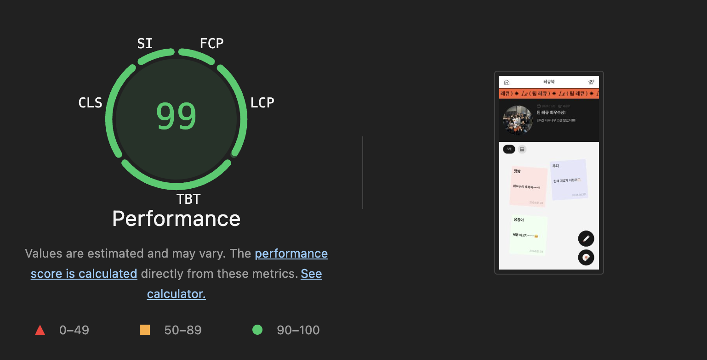
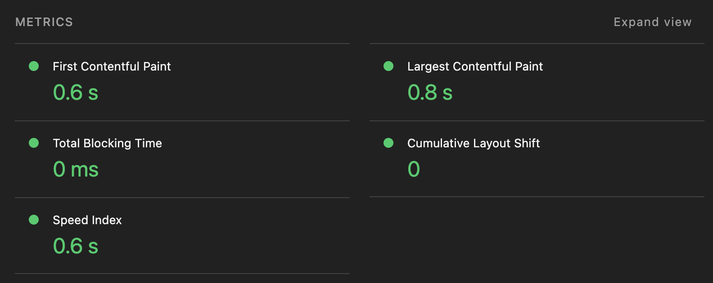

번들을 분석한 결과입니다. 번들이 의도한 대로 잘 스플리팅되어 있고, 초기 로딩 시 필요한 번들 크기가 5.64MB -> 1.97MB로 대략 65% 감소한 것을 확인할 수 있습니다.

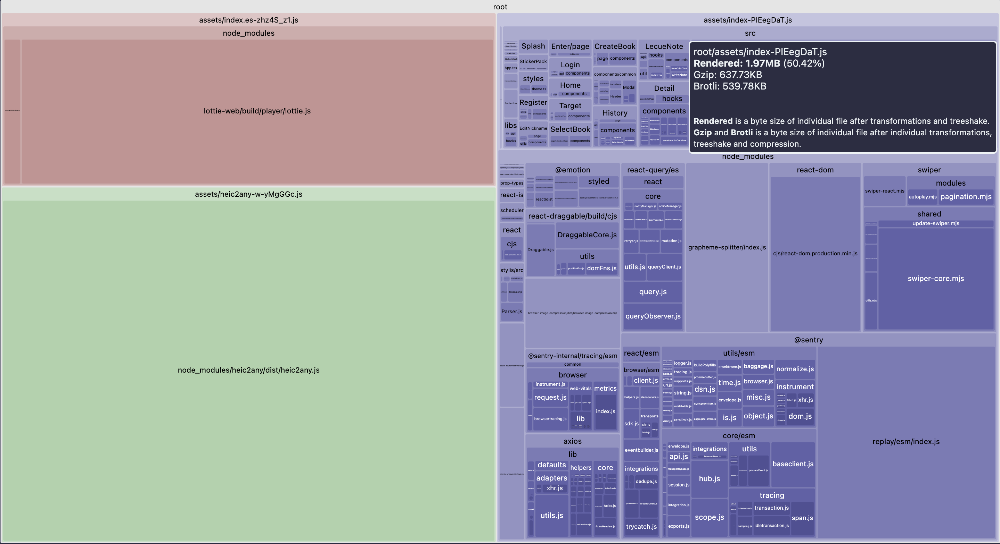

이렇게 유저 플로우를 고려한 코드스플리팅으로 인해 유저는 유저는 빠른 초기 렌더링을 통해 즉각적으로 콘텐츠를 확인할 수 있고, 이후 페이지 이동 시에도 추가 로딩으로 인한 체감 지연 없이 자연스러운 흐름을 유지할 수 있게 되었습니다.

또 리소스 로딩시에 Skeleton UI를 활용하여 체감 로딩 시간을 최적화하였으며, 효율적인 리소스 로딩으로 실제 Lottie를 보기까지의 시간을 단축시킬 수 있었습니다.
