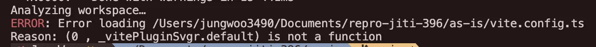
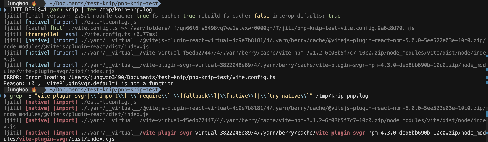
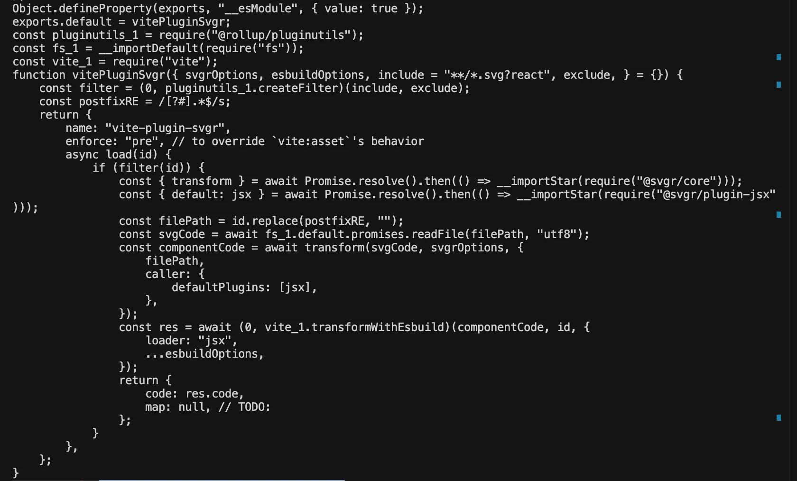
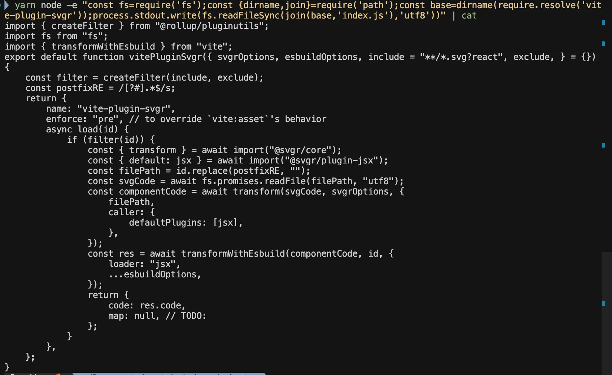

Knip이라는 라이브러리는 사용되지 않는 의존성이나 export, 파일 및 타입 정의를 찾아주고 정리해주는 라이브러리입니다.

회사에서 작업을 하던 중, Yarn Pnp 환경에서 Knip을 사용하면 다음과 같은 오류가 발생하는 문제를 식별했습니다.



신기했던 건, 다른 패키지 매니저에서는 모두 정상적으로 동작했고, 심지어 yarn nodeLinker를 node-modules로 지정하고 동작시켜도 오류가 발생하지 않았습니다. 이 이유가 궁금했고, 특정 패키지 매니저에만 에러가 나는 건 해결이 필요하다고 생각했기 때문에 코드를 분석해보았습니다.

## Knip이 미사용 코드를 찾아내는 과정

Knip은 미사용 코드를 어떻게 찾아낼까요?

먼저, Knip은 프로젝트 분석을 위해 가장 먼저 프로젝트의 구조를 파악합니다.

그 후, 패턴별로 파일을 분류하고 파일 유형에 따라 정적/동적 로드 및 파싱을 진행합니다. 이 과정은 꽤 복잡하기 때문에 밑에서 더 자세히 설명하겠습니다.

다음으로, 의존성 그래프를 구축합니다.

```js
// 2단계에서 얻은 정보로 분석 시작
const dependencyGraph = {
  entryPoints: ["src/main.ts", "src/App.tsx"],
  dependencies: new Map(),
  exports: new Map(),
  imports: new Map(),
}

// 각 파일을 재귀적으로 분석
function analyzeFile(filePath) {
  const content = readFile(filePath)
  const ast = parse(content) // AST 파싱

  // import/export 문 추출
  const imports = extractImports(ast)
  const exports = extractExports(ast)

  dependencyGraph.imports.set(filePath, imports)
  dependencyGraph.exports.set(filePath, exports)
}
```

그 후, 위에서 구축된 의존성 그래프를 기반으로 사용되지 않는 것들을 탐지합니다.

```js
// 의존성 그래프를 기반으로 분석
function findUnused() {
  const usedDependencies = new Set()
  const usedExports = new Set()

  // entry point부터 시작해서 추적
  traverseFromEntryPoints(dependencyGraph, node => {
    usedDependencies.add(node.dependency)
    usedExports.add(node.export)
  })

  // package.json과 비교
  const unusedDependencies = packageJson.dependencies.filter(
    dep => !usedDependencies.has(dep),
  )

  return { unusedDependencies, unusedExports }
}
```

파일 분류 및 로드하는 단계를 더 자세히 알아보겠습니다.
파일 패턴 분석은 플러그인을 통해 정의됩니다. 플러그인은 vite, webpack, jest 등등 다양하게 존재하고, 각 플러그인은 3가지의 패턴을 정의합니다.

1. `entry` 패턴 - 진입점 파일

프레임워크별로 정의되며, 앱의 진입점을 정의합니다.
애플리케이션의 시작점들을 찾아서 의존성 추적의 시작점으로 사용하기 위한 파일이에요.

```js
// packages/knip/src/plugins/astro/index.ts
const entry = ["src/content/config.ts", "src/content.config.ts"]
```

entry 패턴은 다음과 같이 TS AST를 활용하여 **정적 분석**으로 처리됩니다.

```js
// 1. 플러그인의 entry 패턴으로 파일 찾기
const entryFiles = await glob(["src/main.{ts,tsx}"])

// 2. 찾은 파일들을 TypeScript AST로 정적 분석
for (const entryFile of entryFiles) {
  const ast = parse(entryFile)

  // 3. import/export 구문 추출
  const imports = extractImports(ast)
  const exports = extractExports(ast)
}
```

2. `project` 패턴 - 프로젝트 파일

```js
// packages/knip/src/plugins/astro/index.ts
const project = [
  "src/**/*", // 모든 파일
]
```

project 패턴은 프로젝트의 모든 소스 파일들을 찾아서 분석 대상으로 포함하기 위한 파일들입니다.

다음과 같이 **정적 분석**으로 처리돼요.

```js
// 1. 플러그인의 project 패턴으로 파일 찾기
const projectFiles = await glob(["src/**/*.{ts,tsx,js,jsx}"])

// 2. 찾은 파일들을 TypeScript AST로 정적 분석
for (const projectFile of projectFiles) {
  const ast = parse(projectFile)

  // 3. import/export 구문 추출
  const imports = extractImports(ast)
  const exports = extractExports(ast)
}
```

3. `config` 패턴 - 설정 파일

```js
// packages/knip/src/plugins/vite/index.ts
const config = [
  "vite.config.{js,ts,mjs,cjs}",
  "vitest.config.{js,ts,mjs,cjs}",
  "astro.config.{js,ts,mjs,cjs}",
]

// packages/knip/src/plugins/webpack/index.ts
const config = [
  "webpack.config.{js,ts,mjs,cjs}",
  "webpack.{dev,development,prod,production}.config.{js,ts,mjs,cjs}",
]

// packages/knip/src/plugins/jest/index.ts
const config = ["jest.config.{js,ts,mjs,cjs}", "jest.setup.{js,ts,mjs,cjs}"]
```

설정 파일들의 패턴이고, 이 친구들은 동적으로 분석됩니다.
동적 분석 로직은 다음과 같아요.

```js
// 1. 플러그인의 config 패턴으로 파일 찾기
const configFiles = await glob(["vite.config.{js,ts,mjs,cjs}"])
// -> ['vite.config.ts', 'vitest.config.ts']

// 2. 찾은 파일들을 jiti로 동적 실행
for (const configFile of configFiles) {
  const config = await jiti.import(configFile) // 실행!

  // 3. 실행 결과에서 의존성 추출
  const dependencies = extractDependenciesFromConfig(config)
}
```

여길 보시면 Jiti라는 친구가 있습니다. Jiti는 TS, ESM 모듈을 런타임에 실행할 수 있도록 도와주는 라이브러리입니다.
Knip은 Jiti를 활용해서 설정 파일을 동적으로 분석합니다.

```js
const config = await jiti.import(configFile) // 실행!
```

`vite.config.ts`에서 오류가 발생했기 때문에, Jiti에서 어떻게 config 파일을 동적 import하는지 분석해보겠습니다.

## Jiti의 모듈 로드 방법

Jiti에서는 로드할 모듈 경로를 찾게 되는데, 주목해야 할 부분은 이 부분입니다.

```js
// Try resolving with ESM compatible Node.js resolution in async context
const conditionSets = (
  options?.async
    ? [options?.conditions, ["node", "import"], ["node", "require"]]
    : [options?.conditions, ["node", "require"], ["node", "import"]]
).filter(Boolean)
for (const conditions of conditionSets) {
  try {
    resolved = resolvePathSync(id, {
      url: parentURL,
      conditions,
      extensions: ctx.opts.extensions,
    })
  } catch (error) {
    lastError = error
  }
  if (resolved) {
    return resolved
  }
}
```

Knip에서 Jiti.import로 설정 파일을 비동기로 실행시켰는데, 비동기 import로 실행하게 되면, jiti는 내부적으로 async 옵션 flag를 항상 true로 설정하고 async 해석 경로를 타게 됩니다.
그러면 options?.async가 true이므로 [options?.conditions, ["node", "import"], ["node", "require"]] 순서로 모듈 경로 해석을 시도하게 됩니다.

Jiti.import에서 condition에 대한 아무런 조건도 주지 않았으므로 options?.conditions은 pass하게 되고, 다음으로 ["node", "import"]로 시도를 하게 됩니다.

```js
(conditions = ["node","import"], resolvePathSync(...))
```

Jiti는 모듈 경로 해석에 우선적으로 `mlly`의 동기적 해석 방법을 사용합니다. 이를 1 Phase라고 하겠습니다.
하지만, mlly는 import 해석에 파일시스템 기반의 `import-meta-resolve`를 그대로 사용합니다. PnP의 `pnpapi(ZipFS)` 훅을 전혀 타지 않습니다.

```js
import { moduleResolve } from "import-meta-resolve";

function _tryModuleResolve(id: string, url: URL, conditions: any): URL | undefined {
  try {
    return moduleResolve(id, url, conditions) as URL; // import-meta-resolve
  } catch (error: any) {
    if (!NOT_FOUND_ERRORS.has(error?.code)) { throw error; }
  }
}
```

그래서 PnP에서 모듈 경로를 해석할 수 없고, 결국 ["node", "import"]로 mlly 해석이 실패하게 됩니다. 이어서["node", "require"]로 mlly 해석을 시도하게 됩니다. 하지만 PnP 환경이므로 위와 동일한 이유로 모듈 경로 해석에 실패하게 됩니다.

1 Phase에서 모두 실패하면 Native require.resolve로 fallback하여 경로 해석을 시도하게 됩니다.
이를 2 Phase라고 하겠습니다.

```js
// Try native require resolve with additional extensions and /index as fallback
try {
  return ctx.nativeRequire.resolve(id, { paths: options.paths })
} catch (error) {
  lastError = error
}
for (const ext of ctx.additionalExts) {
  resolved =
    tryNativeRequireResolve(ctx, id + ext, parentURL, options) ||
    tryNativeRequireResolve(ctx, id + "/index" + ext, parentURL, options)
  if (resolved) {
    return resolved
  }
  // Try resolving .ts files with .js extension
  if (
    TS_EXT_RE.test(ctx.filename) ||
    TS_EXT_RE.test(ctx.parentModule?.filename || "") ||
    JS_EXT_RE.test(id)
  ) {
    resolved = tryNativeRequireResolve(
      ctx,
      id.replace(JS_EXT_RE, ".$1t$2"),
      parentURL,
      options,
    )
    if (resolved) {
      return resolved
    }
  }
}
```

문제가 발생한 `vite-plugin-svgr` package.json의 `exports` 필드를 보면 다음과 같이 되어있습니다.

```json
"exports": {
    ".": {
      "types": "./dist/index.d.ts",
      "import": "./dist/index.js",
      "require": "./dist/index.cjs"
    },
    "./client": {
      "types": "./client.d.ts"
    }
  },
```

Native require.resolve가 성공하게 되고, index.cjs를 가져오게 됩니다.
실제로 밑에 제가 테스트한 사진을 보면 최종적으로 cjs가 선택된 것을 볼 수 있습니다.



선택된 index.cjs는 동적 import로 로드되게 됩니다. async가 true이면 파일 타입과 무관하게 import()를 사용하기 때문입니다.

```js
  return async && ctx.nativeImport
    ? ctx
        .nativeImport(normalizeWindowsImportId(id))
        .then((m: any) => jitiInteropDefault(ctx, m))
    : jitiInteropDefault(ctx, ctx.nativeRequire(id));
```

index.cjs 번들을 로깅해보았는데, 다음과 같았습니다.



ESM에서 CommonJS를 import 할 때 호환성을 위해 몇가지 호환 규칙이 적용되는데, 이를 CJS interop이라고 합니다.

그 중 한 가지 규칙은 ESM에서 CommonJS 모듈을 `import`로 불러오면, `default` 속성이 CJS의 `module.exports`를 가리키도록 만든다는 것입니다.
즉 `m.default === module.exports` 가 성립하게 만듭니다.

왜일까요??

```js
// lodash/index.cjs
module.exports = function camelCase(str) {
  /* ... */
}
```

이렇게 하고

```js
import camelCase from "lodash"
```

이렇게 ESM import로 불러오면 ESM은 default 내보내기를 가져오는데, default라는 개념이 CJS에 없으니까 undefined여야 합니다.

하지만 개발자들은 이미 Babel, Webpack, Rollup 환경에서 오래 전부터 이런 식의 코드가 잘 동작하는 경험을 해 왔어요.
그 이유는 트랜스파일러들이 CJS `module.exports`를 ESM의 `default`로 강제로 매핑했기 때문입니다. 이걸 기본적으로 지원하자 해서 생긴 interop입니다.

module.exports를 특별히 지정해주지 않으면 기본적으로 객체가 됩니다.
그래서 `exports.default = fn`만 하고 `module.exports = fn`을 안 하면 `module.exports`는 `{ default: fn }` 객체가 되어버립니다.

자 여기까지 본 다음에, 위애 제가 로깅한 cjs 번들을 보면

```js
exports.default = vitePluginSvgr
```

이렇게 되어있는 것을 확인할 수 있습니다.
결국 위에 설명한 규칙에 따라 module.exports는 `{ default: vitePluginSvgr, __esModule: true }`와 같은 형태의 객체가 되어버리고, m.default는 이 객체를 가리키게 됩니다.

Jiti는 ESM과 CJS 간의 호환성을 보장하기 위해 Proxy를 사용합니다.

Jiti interop Proxy가 .default 접근 시 반환하는 값은 다음과 같습니다.

- default가 존재하면 그대로 반환(def)
- 존재하지 않을 때만 모듈 전체(mod)를 “합성 default”로 돌려줌

```js
return new Proxy(mod, {
	get(target, prop, receiver) {
    if (prop === "__esModule") {
      return true;
    }
    if (prop === "default") {
      return defIsNil ? mod : def;
    }
    ...
```

m.default가 존재하고, CJS interop에 의해 module.exports를 가리키는데, module.exports는 객체입니다.
결국 이 Proxy는 .default 접근 시 그대로 이 객체를 반환하게 됩니다.

vite.config.ts에서는 svgr() 형태로 호출하게 되는데, svgr은 결국 함수가 아닌 객체를 바라보고 있고, 객체를 호출하려 하니 `“(0, vitePluginSvgr.default) is not a function”` 오류가 발생한 것입니다.

그렇다면 `node_modules` 기반의 패키지 매니저는 왜 잘 동작한 것일까요??

위에 모듈 해석 방법으로 돌아가면, 1 Phase에서는 `mlly`의 동기적 해석 방법을 사용하고, `mlly`는 import 해석에 파일시스템 기반의 `import-meta-resolve`를 그대로 사용합니다.

동일하게 Jiti.import에서 condition에 대한 아무런 조건도 주지 않았으므로 `options?.conditions`은 pass하게 되고, 다음으로 `["node", "import"]`로 시도를 하게 됩니다.
여기서, PnP와 다르게 `node_modules`는 `import-meta-resolve` 와 호환되므로 `["node", "import"]`로 `mlly` 해석이 성공하고, ESM인 `vite-plugin-svgr/dist/index.js` 을 반환합니다.

다음은 nodeLinker를 `node-modules`로 변경한 뒤 직접 터미널에 찍어본 로그입니다.
`index.js`가 가져와지는 것을 확인할 수 있습니다.

`index.js` 내용은 다음과 같습니다.



default 기본 내보내기 자체가 vitePluginSvgr 함수이고, 이 모듈을 동적 import하면 함수가 불러와지게 됩니다. 즉, m.default가 vitePluginSvgr 함수를 바라보게 됩니다.
마찬가지로 vite.config.ts에서 svgr() 형태로 호출하게 되는데, 이번에는 svgr이 vitePluginSvgr 함수를 바라보고 있어 정상적으로 호출이 되어서 오류가 발생하지 않은 것입니다.

## 해결 방법

이 문제의 원인을 일반화시켜보면, CJS 모듈이 `{ __esModule: true, default: function }` 형태일 때 Jiti의 Proxy가 .default 접근 시 객체 전체를 반환해버린다는 것입니다. 하지만 실제로는 def.default에 접근해서 함수를 반환해야 합니다.

저는 다음과 같이 Jiti의 interopDefault 로직을 수정했습니다.

```js
if (prop === "default") {
  if (
    mod.__esModule && // ESM에서 컴파일된 CJS 모듈만
    !defIsNil && // default가 존재하고
    typeof def === "object" && // default가 객체이며
    typeof def.default === "function" // 그 안의 default가 함수일 때
  ) {
    return def.default // 함수를 직접 반환
  }
  return defIsNil ? mod : def
}
```

이 라이브러리는 굉장히 많은 곳에서 의존성으로 사용하고 있는 라이브러리이기 때문에, 최대한 기존 로직은 건들지 않고 확장하는 방향으로 진행해야 합니다. 그래서 저는 def가 객체이고, def.default가 함수일 경우에만 def.default를 반환하도록 예외 로직을 추가해주었습니다.
https://github.com/unjs/jiti/pull/396 PR에서 실제 기여 내용을 확인할 수 있습니다.

추가적으로 `__esmodule` 플래그도 검사하고 있는데, 이것은 ESM에서 CJS로 컴파일된 모듈에 한해서만 동작하여 안전성을 보장하기 위해서입니다. 이 플래그가 없다면 기존에 잘 동작하던 순수 CJS 모듈이 추가한 조건문에 의해 의도치 않은 동작을 할 수도 있기 때문입니다.

제가 수정한 부분은 2.6.0 마이너 업데이트에 반영되었고, knip에서도 업데이트가 잘 진행되어 현재 Yarn PnP에서도 knip이 정상 동작하게 되었습니다.
